# sway-launch

> [!NOTE]
> This project was built with AI assistance (Claude). It hasn't necessarily been reviewed by a
> human, and comes with no guarantees of correctness, security, or fitness for any particular
> purpose — read through the code yourself before relying on it.

`sway-launch` is a CLI for the [Sway](https://swaywm.org/) window manager. It launches an
application, waits for its window to appear via Sway's IPC event stream, then optionally runs
follow-up actions against that window — floating, fullscreen, resizing, moving to a
workspace/output, splitting, marking, and more (see [Actions reference](#actions-reference)).

- **Deterministic** — blocks until the window exists, and until each follow-up action is confirmed
  wherever Sway exposes a reliable event or observable tree state to confirm it against, so layouts
  build up reliably with no manual `sleep`s or race conditions. Percentage-based `--height`/`--width`
  (`ppt`) are the one exception — there's no reference dimension available to verify a percentage
  against, so those always fall back to the configured wait time instead of an actual confirmation.
  Window correlation itself is deterministic whenever the launched process's own marker is
  observable, and falls back to a bounded heuristic on the rare occasions it isn't (see
  [Basic usage](#basic-usage)) — chaining calls sequentially, the default and recommended way to use
  this tool, keeps things fully deterministic throughout.
- **Zero setup** — a single static binary; no daemon, no config file. Chain calls directly in a
  shell script.
- **Built-in template library** — dozens of ready-made grid, sidebar, and master/stack layouts
  ship inside the binary. Apply one to any set of applications with `--template <name> --apps ...`
  — no files to write (see [Templates](#templates)).
- **Works on existing windows too** — not just newly launched ones, via
  `--con-id`/`--existing` (see [Target an existing window](#target-an-existing-window)).

Requires a running Sway session — `sway-launch` talks to Sway over its IPC socket (the same one
`swaymsg` uses), so it won't do anything useful outside of one.

## Table of contents

- [Installation](#installation)
- [Quickstart](#quickstart)
- [Basic usage](#basic-usage)
- [Recreatable layouts](#recreatable-layouts)
  - [Examples](#examples)
  - [Layout files](#layout-files)
  - [Templates](#templates)
- [Actions reference](#actions-reference)
  - [Target an existing window](#target-an-existing-window)
  - [Floating](#floating) · [Sticky](#sticky) · [Fullscreen](#fullscreen) · [Focus](#focus) ·
    [Mark](#mark)
  - [Workspace](#workspace) · [Output](#output) · [Height and width](#height-and-width) ·
    [Position](#position) · [Split](#split) · [New column](#new-column) · [New row](#new-row) ·
    [Scratchpad](#scratchpad)
  - [Verbose](#verbose) · [JSON output](#json-output) · [Dry run](#dry-run) ·
    [Validate](#validate) · [Wait time](#wait-time) · [Debug events](#debug-events)

## Installation

Build from source with Cargo:

```shell
cargo build --release
```

The binary is written to `target/release/sway-launch` — put it somewhere on your `PATH`.

Prebuilt Linux x86_64 binaries for tagged releases are also available from the
[Releases page](https://github.com/donnex/sway-launch/releases).

Shell completions (bash, zsh, fish, elvish, PowerShell) can be generated with `--completions
<SHELL>`, e.g.:

```shell
# User-local (no root needed):
sway-launch --completions bash > ~/.local/share/bash-completion/completions/sway-launch

# System-wide — note the redirect has to run as root too, so `sudo sway-launch ... >` won't work:
sway-launch --completions bash | sudo tee /usr/share/bash-completion/completions/sway-launch
```

```shell
Launch an application, wait for its Sway window, then run follow-up actions against it

Usage: sway-launch [OPTIONS] [COMMAND]

Arguments:
  [COMMAND]  Command to execute

Options:
  -a, --app-id <APP_ID>               app_id match. With --existing, matches an already-open window instead of the newly launched one
  -c, --class <CLASS>                 class match. With --existing, matches an already-open window instead of the newly launched one
      --mark-match <MARK_MATCH>       Mark match. With --existing, matches an already-open window carrying this mark instead of the newly launched one
      --con-id <CON_ID>               Act on an already-open window with this container id, instead of launching a new one
      --existing                      Act on an already-open window found via --app-id/--class/--mark-match, instead of launching a new one
  -s, --split <SPLIT>                 Change split for new window [possible values: v, h]
  -f, --floating                      Make new window floating
      --sticky                        Make new window sticky (shows on all workspaces)
      --fullscreen                    Make new window fullscreen
      --focus                         Focus new window
  -m, --mark <MARK>                   Add mark to new window
  -n, --new-column                    Move window to new column (move right)
      --height <HEIGHT>               Set height on new window
      --width <WIDTH>                 Set width on new window
  -r, --new-row                       Move window to new row (move down)
      --workspace <WORKSPACE>         Move new window to workspace
      --output <OUTPUT>               Move new window to output (monitor)
      --position <POSITION>           Set position on new window. Either "center" or "<x>,<y>" in pixels (x/y may be negative)
      --scratchpad                    Move window to the scratchpad
      --dry-run                       Print the planned sequence of Sway commands instead of running them — works with a direct command or --layout/--template. Never touches Sway IPC or launches anything
      --validate                      Validate a --layout/--template file (and, for --template, --bindings/--apps resolution) without launching anything or touching Sway IPC. Requires --layout or --template
  -t, --timeout <TIMEOUT>             Timeout in seconds [default: 5]
  -w, --wait-time <WAIT_TIME>         Wait time in ms. Used for actions that do not have a corresponding Sway IPC event [default: 20]
  -d, --debug-events                  Debug events. Output all Sway IPC events until stopped
      --completions <COMPLETIONS>     Generate a shell completion script and print it to stdout [possible values: bash, elvish, fish, powershell, zsh]
  -v, --verbose                       Verbose output
      --json                          Print the result as a JSON object instead of a bare container id
      --layout <LAYOUT>               Run a declarative TOML layout file instead of a single command; see README.md for the schema. Each step is the equivalent of one sway-launch invocation's flags, so this conflicts with every per-window flag below, which would otherwise apply to no specific step
      --template <TEMPLATE>           Run a reusable declarative TOML layout template instead of a single command; see README.md for the schema. Steps declare a `slot` instead of an application, resolved via --bindings or --apps. Either a path to a template file ending in .toml, or a built-in template name with no extension (see --list-templates). Conflicts with --layout and every per-window flag, same reasoning as --layout
      --list-templates                List built-in --template names and exit
      --show-template <NAME_OR_PATH>  Print a --template's raw TOML and exit, without running it. Same NAME_OR_PATH resolution as --template: a built-in name (see --list-templates), or a path ending in .toml. With --json, prints {"name": ..., "contents": "..."}
      --bindings <BINDINGS>           Bindings file supplying each --template slot's application identity. Requires --template; conflicts with --apps
      --apps <APPS>                   Comma-separated list of commands to launch into --template's slots, in the order they first appear in the template. Requires --template; conflicts with --bindings
      --rollback-on-error             If a later --layout/--template step fails, kill every window this invocation itself launched by an earlier, already-completed step (not one it merely retargeted via con_id/existing/target_id), rather than leaving them open. Requires --layout or --template
  -h, --help                          Print help (see more with '--help')
  -V, --version                       Print version
```

(`--help` prints the same options in a longer, one-paragraph-per-flag form.)

## Quickstart

A few commands to try immediately — each one blocks until confirmed, so nothing here needs a
manual wait between them.

```shell
# Launch a terminal, wait for it to appear
$ sway-launch foot
271
```

```shell
# Two terminals side by side — the second command doesn't start until the first window exists
sway-launch -a foot --split h foot
sway-launch -a foot foot
```

```shell
# Floating, centered, and sized — all in one command
sway-launch --floating --position center --width 800px --height 500px foot
```

```shell
# An instant 2x2 grid from a built-in template — no files to write
sway-launch --template quad-grid --apps foot,foot,foot,foot
```

```shell
# See every built-in template shape
sway-launch --list-templates
```

See [Basic usage](#basic-usage) below for chaining and window-matching in more depth, and
[Templates](#templates) for the full built-in library.

## Basic usage

Beyond the Quickstart commands above, a command passed to `sway-launch` must be quoted when it
contains spaces, e.g. `'firefox --new-window https://example.com'`.

Since the container id of the matching window is returned, it's also possible to combine
`sway-launch` with custom `swaymsg` commands.

```shell
#!/bin/sh
container_id="$(sway-launch foot)"
swaymsg "[con_id=$container_id] move workspace 1"

container_id="$(sway-launch foot)"
swaymsg "[con_id=$container_id] floating enable, move position center"

sway-launch 'firefox --new-window https://example.com'
sway-launch 'firefox --new-window https://example.com'
```

It is possible to add additional checks against the new window, to make sure it matches a given
`app_id` or `class`. This is useful when several windows end up open around the same time (e.g.
later in a layout script) and you need to make sure each `sway-launch` call matches the correct
one.

```shell
sway-launch -a foot foot
sway-launch -c Code code
```

`--app-id` and `--class` can't be combined — pick whichever matches the application (native
Wayland apps expose `app_id`; XWayland apps expose `class`).

**Prefer running `sway-launch` calls one at a time over backgrounding them.** Every example in
this README — and `--layout`/`--template`'s own step-by-step execution — chains calls
sequentially, each one finishing (its window matched and confirmed) before the next starts, and
that's still the recommended, fully reliable way to use it. Launching a new window (no
`--con-id`/`--existing`) correlates the window it matches back to the specific process it spawned,
so two `sway-launch` processes launching ordinary applications at the same time (e.g. backgrounded
with `&`) no longer collide on each other's windows — this correlation is deterministic whenever
that process's own marker is observable, which is the case that matters in practice. It falls back
to a bounded heuristic (the first plausibly-matching window seen, after a short grace period) only
when the marker genuinely can't be observed: that correlation can't help for a single-instance
application (a browser, an editor) that's already running, since invoking it again typically just
forwards the request to the existing instance and exits immediately, so the new window is
legitimately owned by a process `sway-launch` never spawned — nothing to correlate against. Two
concurrent invocations both targeting a single-instance application can still collide in that
specific case; a heavily loaded system can, in principle, also delay marker observation long enough
to hit the same fallback even for an ordinary application. When in doubt, chain calls sequentially.

The marker is read back through `/proc`, so on a system without it (a BSD running Sway, an unusual
container) every launch resolves through that same bounded fallback rather than the deterministic
path. Nothing breaks — the fallback is what the single-instance case already uses, and a window it
can't confirm is never treated as this run's own for `--rollback-on-error` — but correlation is
best-effort there, so sequential chaining matters more.

## Recreatable layouts

Since `sway-launch` blocks on every command, its arguments can be combined into scripts that
recreate a static window setup/layout — for example, always setting up workspace 1 the same way
when Sway starts, or starting VS Code together with three terminals arranged in a certain way via
a launch script.

Not everything will work with the current implementation — it all depends on the layout and the
current workspace state. Most issues should be fixable by capturing the container id and running
some additional `swaymsg` commands.

The `foot` terminal — Sway's own default — is used as a stand-in application in most of these
examples; a few combine several different applications to show off more advanced layouts.

### Examples

Runnable example scripts live in [`examples/scripts/`](examples/scripts/) — each one is a small,
standalone shell script built entirely out of `sway-launch` calls; run any of them directly (e.g.
`examples/scripts/quad-terminals`) against a live Sway session to see the layout it builds. The
advanced examples expect Firefox, Chromium, Thunar, and VS Code (the `code` command) to be
installed and on `PATH`, in addition to `foot`. Declarative `--layout` example files live alongside
them in [`examples/layouts/`](examples/layouts/); `--template` files live in
[`templates/`](templates/) at the repo root instead — see [Templates](#templates) below for why.

Basic (all `foot`):

- [`examples/scripts/dual-terminals`](examples/scripts/dual-terminals) — two terminals side by
  side, one row.
- [`examples/scripts/triple-row`](examples/scripts/triple-row) — three terminals side by side, one
  row.
- [`examples/scripts/column-split`](examples/scripts/column-split) — two terminals stacked in one
  column.
- [`examples/scripts/quad-terminals`](examples/scripts/quad-terminals) — four terminals as a 2x2
  grid, two rows.
- [`examples/scripts/workspace-and-position`](examples/scripts/workspace-and-position) — a
  floating terminal moved to workspace 2 and centered. Demonstrates `--workspace` and `--position`
  together.
- [`examples/scripts/retarget-floating`](examples/scripts/retarget-floating) — a terminal adjusted
  twice after launch, without relaunching it: once via `--con-id` with a captured container id,
  once via `--existing` matching `--app-id`.
- [`examples/layouts/quad-terminals.toml`](examples/layouts/quad-terminals.toml) — the same layout
  as `examples/scripts/quad-terminals`, as a declarative `--layout` file instead of a shell
  script; run with `sway-launch --layout examples/layouts/quad-terminals.toml`. See
  [Layout files](#layout-files) below.
- [`examples/layouts/retarget-by-id.toml`](examples/layouts/retarget-by-id.toml) — two terminals
  sharing an `app_id`, then a third step that retargets specifically the first one by its step
  `id` — something `--existing` can't express, since it'd be ambiguous between the two.
  Demonstrates `id`/`target_id`. Run with `sway-launch --layout
  examples/layouts/retarget-by-id.toml`.
- [`templates/quad-grid.toml`](templates/quad-grid.toml) — the app-agnostic
  version of `examples/layouts/quad-terminals.toml`'s shape: the same 2x2 grid, but with no
  application baked in. Run with `sway-launch --template templates/quad-grid.toml --apps
  foot,firefox,code,thunar` (or any four commands). See [Templates](#templates) below.

Advanced (multiple applications):

- [`examples/scripts/dev-workspace`](examples/scripts/dev-workspace) — VS Code taking most of the
  width, with two terminals stacked in a column beside it. Demonstrates `--app-id` matching
  alongside `--width` and `--new-column`.
- [`examples/scripts/floating-file-manager`](examples/scripts/floating-file-manager) — Thunar as a
  floating, fixed-size window with a mark set, ready for a `for_window` rule to reposition it (see
  [Mark](#mark) below). Demonstrates combining `--floating`, `--width`/`--height`, and `--mark`.
- [`examples/scripts/browser-comparison`](examples/scripts/browser-comparison) — Firefox and
  Chromium side by side on the same page, for comparing how each renders it.
- [`examples/scripts/quad-mixed-apps`](examples/scripts/quad-mixed-apps) — a 2x2 grid like
  `examples/scripts/quad-terminals`, but with four different applications (foot, Firefox, Thunar,
  VS Code) instead of four terminals.
- [`examples/scripts/editor-with-floating-terminal`](examples/scripts/editor-with-floating-terminal)
  — VS Code full-width, with a small floating terminal on top for quick one-off commands.

More advanced layouts should be possible by focusing earlier windows between launches.

### Layout files

Chaining several `sway-launch` calls in a shell script (as every example above does) works well,
but each call is a separate process. `--layout <FILE>` runs a whole layout from one TOML file and
one invocation instead — each `[[step]]` is the equivalent of one CLI call's flags, run in order,
stopping at the first error.

```toml
[[step]]
command = "foot"
app_id = "foot"
split = "h"

[[step]]
command = "foot"
app_id = "foot"
```

```shell
sway-launch --layout layout.toml
```

> [!WARNING]
> A layout file's `command` fields are executed. Running someone else's layout file is exactly as
> dangerous as running their shell script — read it first. The same applies to a `--bindings` file
> (see [Templates](#templates) below). Template files themselves are safe: they contain no commands
> at all, which is what makes them shareable on their own.

A step's keys mirror the CLI flags of the same name (`app_id`, `class`, `mark_match`, `con_id`,
`existing`, `split`, `floating`, `sticky`, `fullscreen`, `focus`, `mark`, `new_column`, `new_row`,
`workspace`, `output`, `height`, `width`, `position`, `scratchpad`, `timeout`, `wait_time`) —
`height`/`width`/`position` are validated the same way their CLI equivalents are, and a step
without its own `timeout`/`wait_time` inherits the top-level `--timeout`/`--wait-time` values.
Exactly one of `command`, `con_id`, `existing = true`, or `target_id` is required per step, matching
the CLI's own command/`--con-id`/`--existing` mutual exclusivity plus one layout-only addition:

- `id` names a step, so a later step can target its window specifically via `target_id` — useful
  when several steps share the same `app_id`/`class`/`mark_match`, where `existing = true` would be
  ambiguous about which one it means. See
  [`examples/layouts/retarget-by-id.toml`](examples/layouts/retarget-by-id.toml).
- `target_id` targets an earlier step's window by that name, instead of `command`/`con_id`/
  `existing`. Errors if the named `id` doesn't exist, or was used by more than one step.

As with the CLI's `--app-id`/`--class`/`--mark-match`, a step can set only one of `app_id`, `class`,
`mark_match` — pick whichever identifies the window. Neither `con_id` nor `target_id` can be
combined with any of the three, same as the CLI: both already name an exact container, so a match
criteria alongside one would only be silently ignored.

Neither has a CLI equivalent — a single `sway-launch` invocation only ever has one step, so
there's nothing to name or reference.

Every top-level per-window flag (`--split`, `--floating`, etc.) conflicts with `--layout`, since it
would otherwise be unclear which step it applied to — `--timeout`, `--wait-time`, `--verbose`, and
`--json` still apply, the latter printing one object at the end (see
[JSON output](#json-output) below) instead of a line per step.

Stopping at the first error leaves whatever earlier steps already launched open by default — add
`--rollback-on-error` to close them automatically instead:

```shell
sway-launch --layout layout.toml --rollback-on-error
```

Only windows this invocation itself launched (a step's `command`) are ever closed — a step that
retargeted an already-open window via `con_id`/`existing`/`target_id` is left alone, since that
window existed before this run and isn't this run's to close. Requires `--layout` or `--template`.

One more window is left alone: one this run matched but couldn't confirm it launched. `sway-launch`
tags the process it starts with a private marker and prefers a window whose process carries it, but
falls back to matching on `app_id`/`class` alone when no marked window appears — which is what makes
single-instance applications (browsers, editors, anything that hands a second invocation off to an
already-running process) work. When that fallback is used because the launched process is *gone*,
nothing marked can still be coming and the window is treated as this run's own. When it's used
because the wait simply elapsed while the launched process is still running, the matching window
came from somewhere else — another launcher, another `sway-launch`, or something the user opened at
the wrong moment — and rollback leaves it open rather than killing a window it can't prove is its
own. It's still reported as an open container id (see `container_ids` under
[JSON output](#json-output)), so a script that wants it closed can do so itself. `--verbose` says
when this happens.

Rollback doesn't check whether a launched window has since been put to other use — it kills any
window it recognizes as its own, best-effort, regardless of what's happened to it since launch.
A kill that fails (usually: that window had already closed on its own) is reported and skipped
rather than stopping the rest of the rollback, and the original step failure stays the error that's
actually reported. With `--json`, the error object includes which container ids were closed, and
which ones couldn't be: `{"error": "...", "rolled_back": [123, 456], "rollback_failed": [789]}`
(see [JSON output](#json-output) below).

This is **window-launch rollback**, not transactional rollback: it undoes *launches*, not
*actions*. A `move`/`resize`/`mark`/etc. an earlier step applied to a `con_id`/`existing`/
`target_id`-retargeted window is never reverted — that window is never eligible for rollback at
all (see above), so any changes an earlier step made to it stay applied even after a later step
fails. There's no mechanism that tracks or reverses individual mutations, only whether this
invocation is the one that created the window in the first place.

### Templates

A `--layout` file bakes a specific application into every step (`command`/`app_id`), which means
reusing one for a different application means editing it. `--template <FILE>` separates the two: a
template step describes *what to do*, and a `slot` names *which window* — the application itself
comes from a separate `--bindings <FILE>` or `--apps <list>`, so the same template can be shared or
reused across completely different applications.

That split has a useful safety property: a template file names no commands anywhere, so it can't
run anything on its own. The commands live in the `--bindings` file (or `--apps`), which you
supply. A template is therefore safe to share and apply to your own applications; a layout or
bindings file from elsewhere should be read first, like any shell script.

```toml
[template]
description = "An editor beside a terminal."
category = "Grid"

[[step]]
slot = "editor"
split = "h"

[[step]]
slot = "terminal"
```

Every template file requires a `[template]` table with `description` and `category` — the source
`--list-templates`/`--show-template --json` read a built-in's name from, and how README.md's own
"Templates" table below groups it alongside similarly-shaped templates (`Grid`, `Master/stack`,
`Sidebar`, `Floating`, `Multi-workspace/output`, `Retargeting`; not a closed set — a new shape can
introduce a new category). `description` should be a complete, self-contained sentence.

Applied to a plain list of commands, launched into the slots in the order they first appear in the
template:

```shell
sway-launch --template template.toml --apps code,foot
```

`--apps` splits its argument on plain commas, with no escaping — a command that itself needs to
contain a literal comma (a URL query string, a `sh -c 'a, b'`) can't be represented this way. Use
`--bindings` instead for that case, since each command there is its own TOML field, not part of a
comma-separated list. Each entry is trimmed of leading/trailing whitespace, so `--apps "foot,
firefox"` works the same as `--apps "foot,firefox"`.

Or applied via a bindings file, for full control over each slot's identity — including matching an
already-open window instead of launching a new one:

```toml
[[binding]]
slot = "editor"
command = "code"
class = "Code"

[[binding]]
slot = "terminal"
existing = true
app_id = "foot"
```

```shell
sway-launch --template template.toml --bindings bindings.toml
```

A `Binding`'s keys are the same target-selection subset a layout step has (`command`, `con_id`,
`existing`, `app_id`, `class`, `mark_match`) — exactly one of `command`/`con_id`/`existing = true` is
required, same rule as `--layout`, and `app_id`/`class`/`mark_match` can set only one of the three,
same rule too. A template step's
action keys (`split`, `floating`, `height`, etc.) are the same
ones `--layout` has; `slot` and `target_id` are its only two target-selection keys, and exactly one
is required per step — a `slot` step resolves its window via a binding, a `target_id` step
retargets an earlier `slot`'s resolved window (see `id`/`target_id` above; a template step's
resolved `id` is always its slot name). `--template` requires exactly one of `--bindings`/`--apps`,
and conflicts with `--layout` and every per-window flag, same reasoning as `--layout`. See
[`templates/quad-grid.toml`](templates/quad-grid.toml).

A template can also declare an optional `[layout]` table, applied to every step that doesn't set
its own `workspace`/`output`:

```toml
[layout]
workspace = "3"
output = "HDMI-A-1"
```

This pins the whole template to a specific workspace/output instead of always operating on
whatever's currently focused when it runs — closes the "works if the workspace/output happens to
already be in the right state" gap noted above. A step's own `workspace`/`output` still wins when
set, applied per field, so a step can mix the template's workspace with its own output (or vice
versa).

Every file under [`templates/`](templates/) is also built into the `sway-launch`
binary itself as a *built-in template* — `--template <name>` (no `.toml` extension, e.g.
`--template quad-grid`) resolves that name against the embedded copy, so using one doesn't require
cloning this repo or downloading anything. A value ending in `.toml` is always read from disk
instead, so a built-in name and a same-named local template file never collide. Run
`sway-launch --list-templates` to print every built-in name with its category, one-line
description, and slot names (in the order `--apps` zips its own comma-separated list against):

```shell
$ sway-launch --list-templates
dual-row     Grid  Two windows side by side in a single row. (2 slots: left, right)
...
```

`--json` reports the same slot info structurally as `slots` (the count) and `slot_names` (the
array), so a script can size or pre-fill `--apps`/a `--bindings` file without parsing the
template's TOML itself.

```shell
sway-launch --template quad-grid --apps foot,firefox,code,thunar
```

To inspect a built-in's exact shape before binding apps to it, `--show-template <NAME_OR_PATH>`
prints its raw TOML and exits without running it — the same `NAME_OR_PATH` resolution `--template`
itself uses, so it works on a built-in name or a local `.toml` file path alike:

```shell
sway-launch --show-template quad-grid
```

Add `--json` for `{"name": "quad-grid", "contents": "..."}` instead of the bare TOML text.

The library below has a small set of other app-agnostic shapes ready to apply to any application
via `--apps`/`--bindings`. Each file's own header comment has a ready-to-run `--apps` example.

Screenshots are generated by `scripts/generate-layout-screenshots` (see CLAUDE.md's "Screenshots"
section) — each is a real `sway-launch --template` run against a live Sway compositor, with every
slot labeled by name.

| Preview | Category | Template | Shape | Slots |
| --- | --- | --- | --- | --- |
| [](screenshots/dual-row.png) | Grid | [`dual-row`](templates/dual-row.toml) | Two windows side by side, one row | 2 |
| [](screenshots/dual-column.png) | Grid | [`dual-column`](templates/dual-column.toml) | Two windows stacked, one column | 2 |
| [](screenshots/triple-row.png) | Grid | [`triple-row`](templates/triple-row.toml) | Three windows side by side, one row | 3 |
| [](screenshots/triple-column.png) | Grid | [`triple-column`](templates/triple-column.toml) | Three windows stacked, one column | 3 |
| [](screenshots/quad-grid.png) | Grid | [`quad-grid`](templates/quad-grid.toml) | Equal 2×2 grid | 4 |
| [](screenshots/six-grid.png) | Grid | [`six-grid`](templates/six-grid.toml) | Equal grid, two rows of three | 6 |
| [](screenshots/eight-grid.png) | Grid | [`eight-grid`](templates/eight-grid.toml) | Equal grid, two rows of four | 8 |
| [](screenshots/nine-grid.png) | Grid | [`nine-grid`](templates/nine-grid.toml) | Equal 3×3 grid | 9 |
| [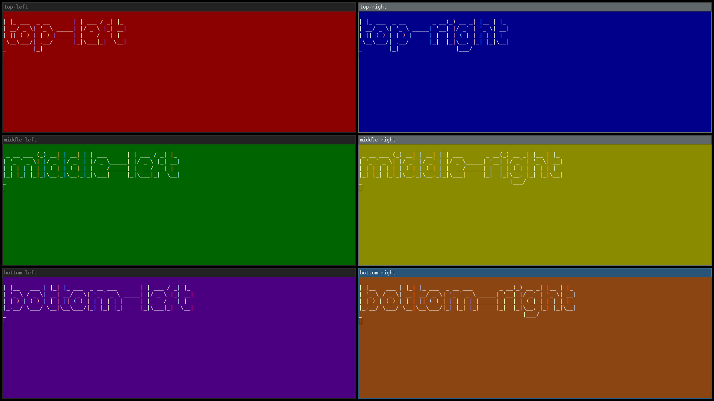](screenshots/six-grid-vertical.png) | Grid | [`six-grid-vertical`](templates/six-grid-vertical.toml) | Equal grid, three rows of two — six-grid.toml rotated | 6 |
| [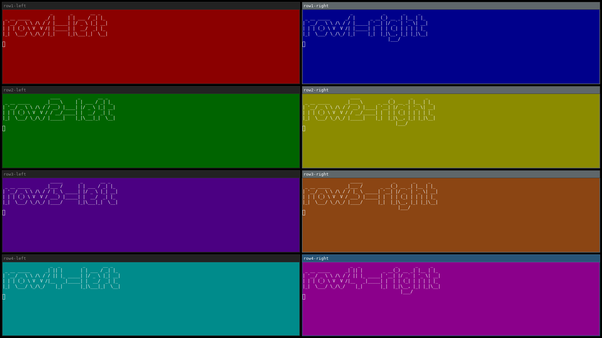](screenshots/eight-grid-vertical.png) | Grid | [`eight-grid-vertical`](templates/eight-grid-vertical.toml) | Equal grid, four rows of two — eight-grid.toml rotated | 8 |
| [](screenshots/master-dual-stack.png) | Master/stack | [`master-dual-stack`](templates/master-dual-stack.toml) | One main window, a 2-window stack beside it | 3 |
| [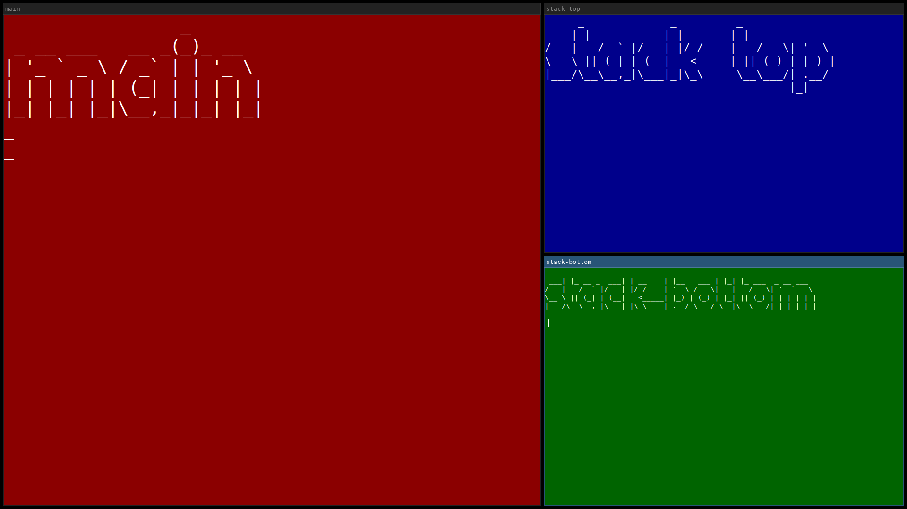](screenshots/master-dual-stack-wide.png) | Master/stack | [`master-dual-stack-wide`](templates/master-dual-stack-wide.toml) | One main window, a 2-window stack beside it (60%/40% instead of master-dual-stack.toml's ~65%/35%) | 3 |
| [](screenshots/master-triple-stack.png) | Master/stack | [`master-triple-stack`](templates/master-triple-stack.toml) | One main window, a 3-window stack beside it | 4 |
| [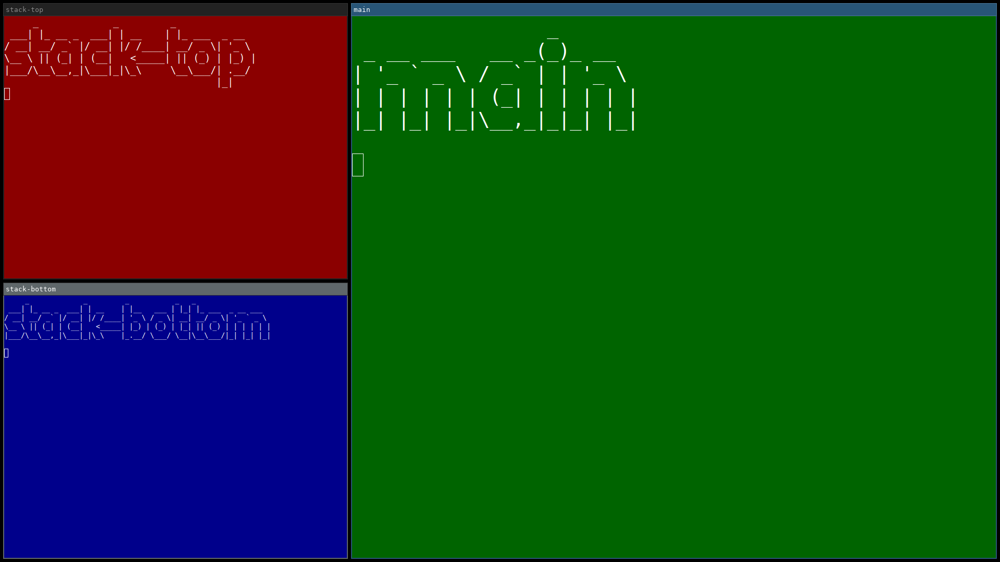](screenshots/master-dual-stack-left.png) | Master/stack | [`master-dual-stack-left`](templates/master-dual-stack-left.toml) | A 2-window stack, one main window beside it — master-dual-stack.toml mirrored | 3 |
| [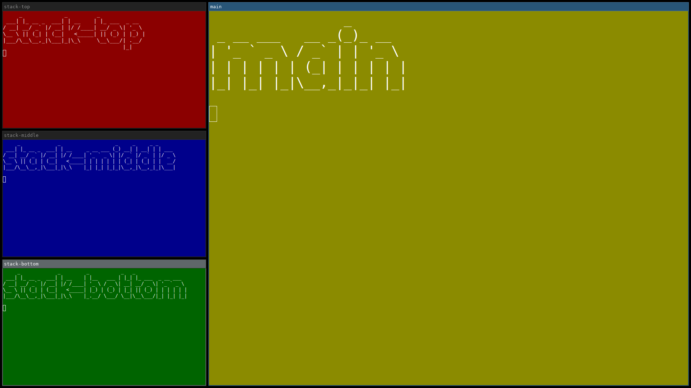](screenshots/master-triple-stack-left.png) | Master/stack | [`master-triple-stack-left`](templates/master-triple-stack-left.toml) | A 3-window stack, one main window beside it — master-triple-stack.toml mirrored | 4 |
| [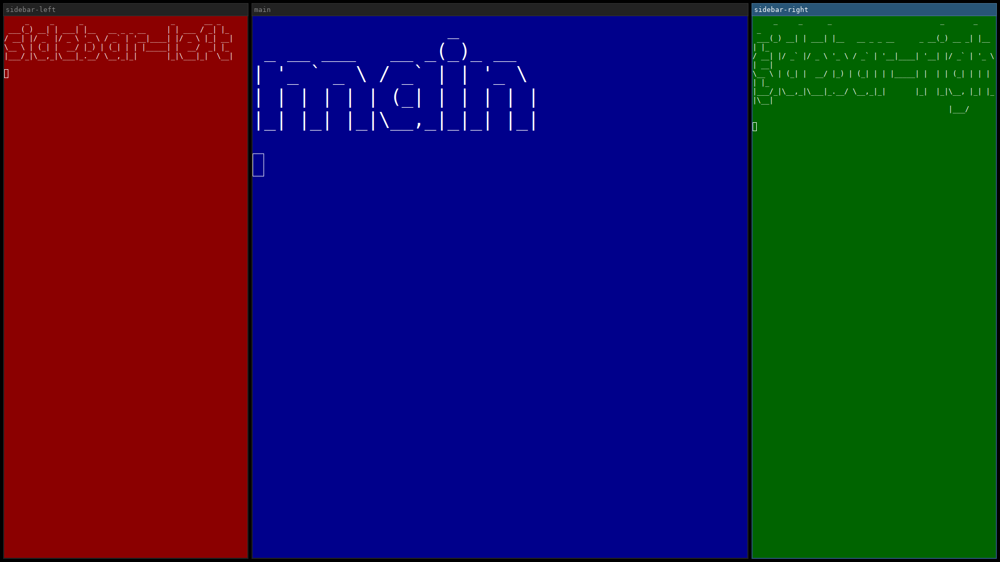](screenshots/dual-sidebars.png) | Master/stack | [`dual-sidebars`](templates/dual-sidebars.toml) | One main window, a single narrow sidebar flanking each side | 3 |
| [](screenshots/dual-stack-sidebars.png) | Master/stack | [`dual-stack-sidebars`](templates/dual-stack-sidebars.toml) | One main window, a 2-window stack flanking each side | 5 |
| [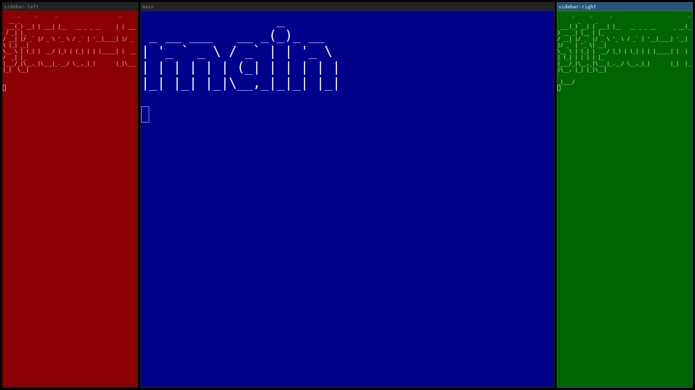](screenshots/dual-sidebars-wide.png) | Master/stack | [`dual-sidebars-wide`](templates/dual-sidebars-wide.toml) | One wide main window, a single narrow sidebar flanking each side (20%/60%/20% instead of dual-sidebars.toml's 50%/25%/25%) | 3 |
| [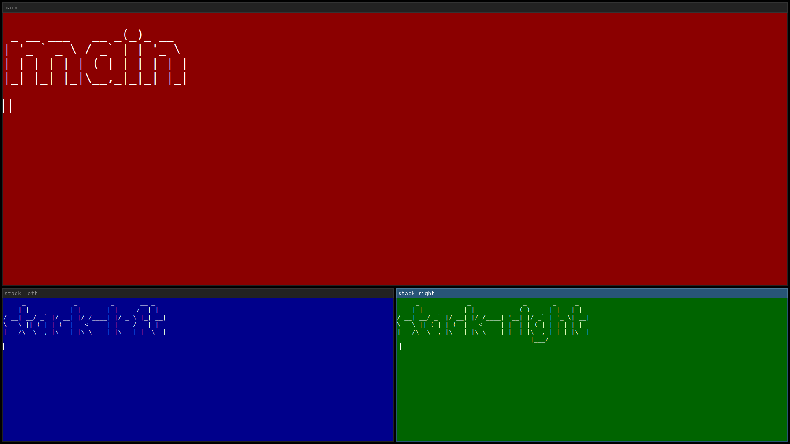](screenshots/master-dual-stack-bottom.png) | Master/stack | [`master-dual-stack-bottom`](templates/master-dual-stack-bottom.toml) | One main window on top, a 2-window stack split below it | 3 |
| [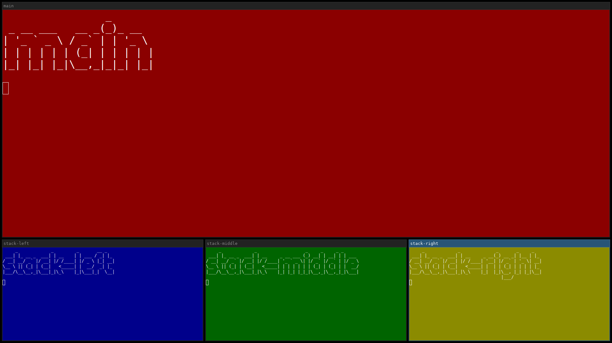](screenshots/master-triple-stack-bottom.png) | Master/stack | [`master-triple-stack-bottom`](templates/master-triple-stack-bottom.toml) | One main window on top, a 3-window stack split below it | 4 |
| [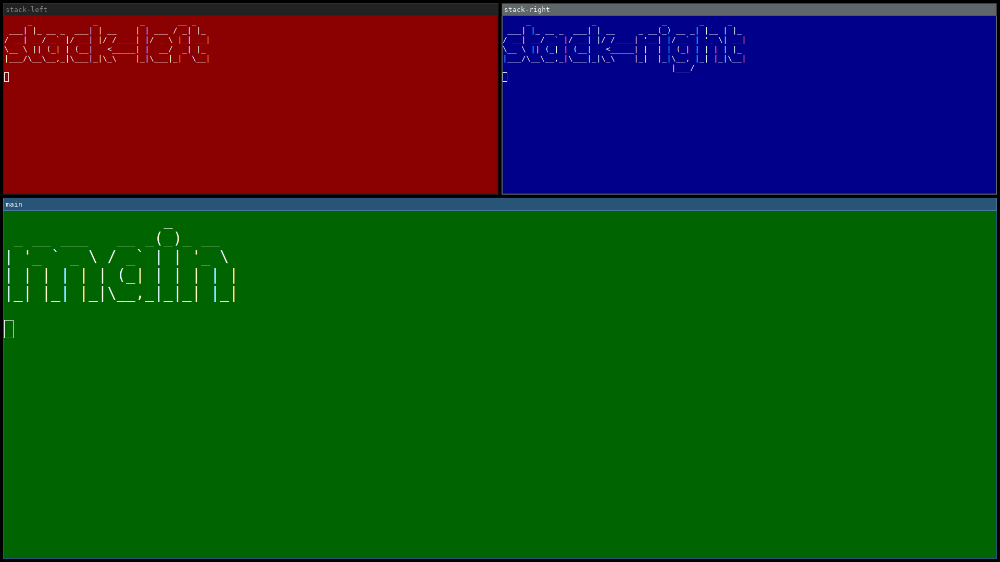](screenshots/master-dual-stack-top.png) | Master/stack | [`master-dual-stack-top`](templates/master-dual-stack-top.toml) | A 2-window stack on top, one main window below it — master-dual-stack-left.toml rotated | 3 |
| [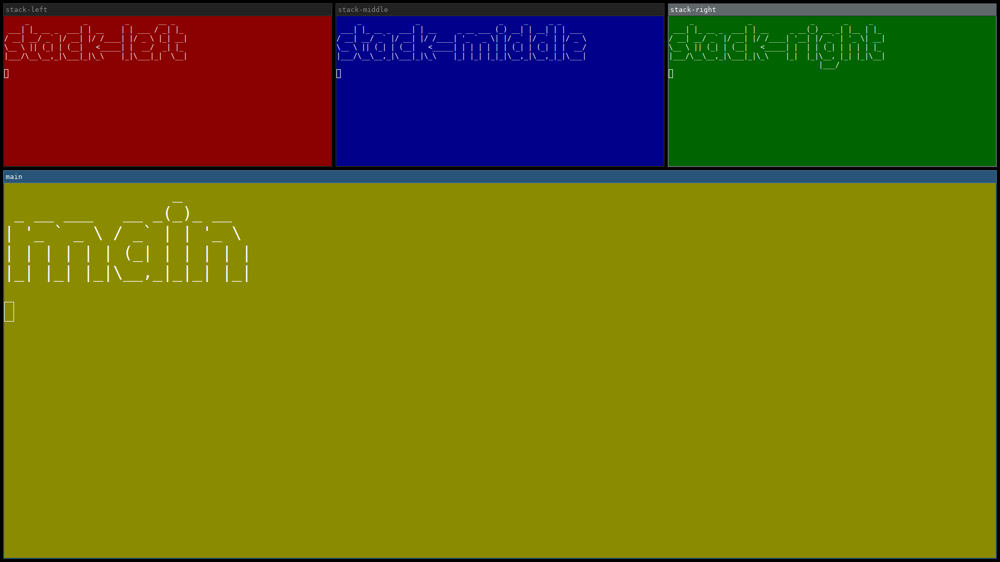](screenshots/master-triple-stack-top.png) | Master/stack | [`master-triple-stack-top`](templates/master-triple-stack-top.toml) | A 3-window stack on top, one main window below it — master-triple-stack-left.toml rotated | 4 |
| [](screenshots/sidebar-left.png) | Sidebar | [`sidebar-left`](templates/sidebar-left.toml) | Narrow sidebar on the left, wide main window on the right | 2 |
| [](screenshots/sidebar-right.png) | Sidebar | [`sidebar-right`](templates/sidebar-right.toml) | Wide main window on the left, narrow sidebar on the right | 2 |
| [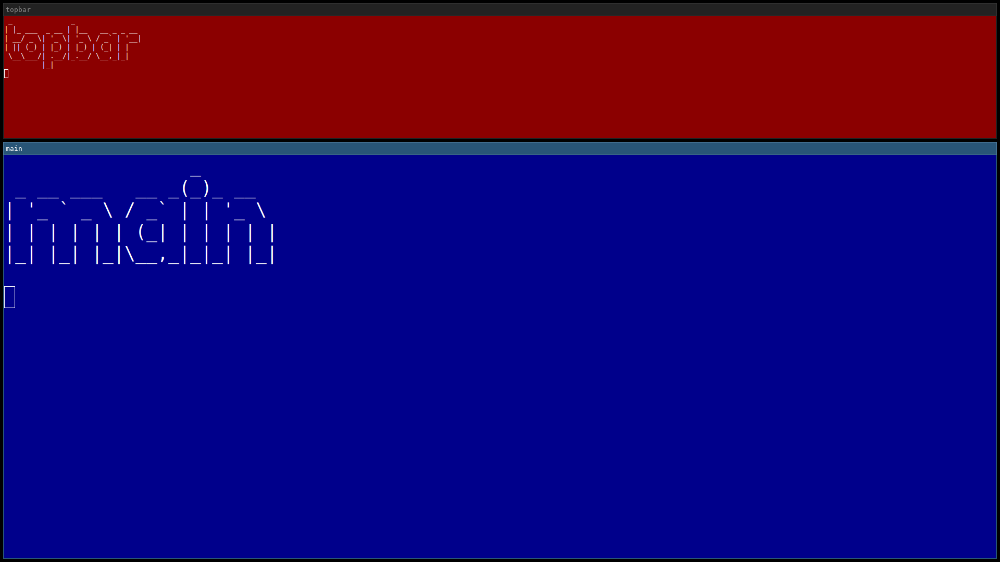](screenshots/sidebar-top.png) | Sidebar | [`sidebar-top`](templates/sidebar-top.toml) | Narrow bar across the top, wide main window below | 2 |
| [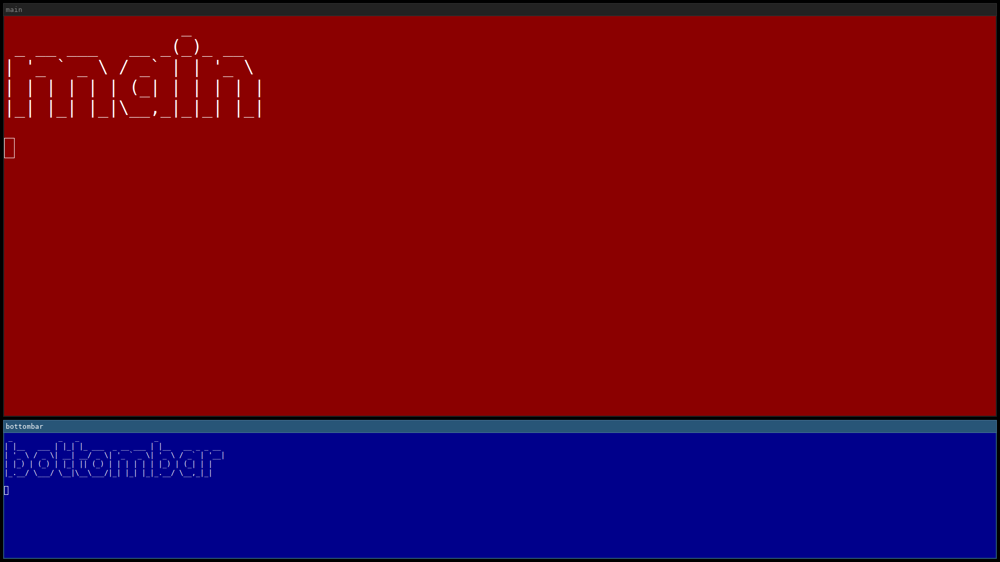](screenshots/sidebar-bottom.png) | Sidebar | [`sidebar-bottom`](templates/sidebar-bottom.toml) | Wide main window on top, narrow bar across the bottom | 2 |
| [](screenshots/sidebar-left-dual-stack.png) | Sidebar | [`sidebar-left-dual-stack`](templates/sidebar-left-dual-stack.toml) | Sidebar on the left split into two windows (75%/25% height), wide main window on the right | 3 |
| [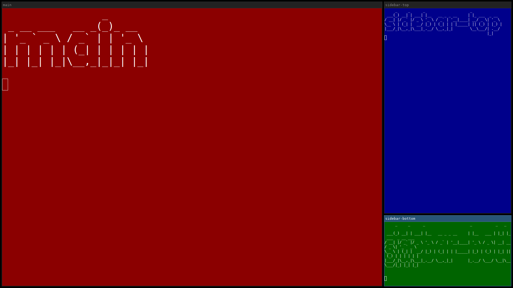](screenshots/sidebar-right-dual-stack.png) | Sidebar | [`sidebar-right-dual-stack`](templates/sidebar-right-dual-stack.toml) | Wide main window on the left, sidebar on the right split into two windows (75%/25% height) | 3 |
| [](screenshots/floating-overlay.png) | Floating | [`floating-overlay`](templates/floating-overlay.toml) | A tiled main window, with a small floating window on top | 2 |
| [](screenshots/floating-centered.png) | Floating | [`floating-centered`](templates/floating-centered.toml) | A single floating window, centered | 1 |
| — | Multi-workspace/output | [`workspace-spread`](templates/workspace-spread.toml) | Each window moved to its own named workspace | 3 |
| — | Multi-workspace/output | [`dual-output`](templates/dual-output.toml) | Each window moved to a different output (monitor) | 2 |
| [](screenshots/retarget-by-slot.png) | Retargeting | [`retarget-by-slot`](templates/retarget-by-slot.toml) | Two windows side by side, then the first one retargeted by slot name | 2 |

`workspace-spread`/`dual-output` have no screenshot — `scripts/generate-layout-screenshots` skips
both, since a single-output screenshot can't meaningfully depict either (see CLAUDE.md's
"Screenshots" section).

## Actions reference

It's possible to run additional actions on the new window. Each action waits for its
corresponding Sway IPC event, or for a static `--wait-time` ms if the action doesn't have one.

Multiple actions can be added to `sway-launch` and they'll be run one after another.

These flags exist for convenience — you could just as well get the container id and run manual
`swaymsg` commands against it, set up window rules with a mark, or use other window rules
directly.

`--timeout` bounds how long an action waits for its confirmation *event* — the part that depends on
an application actually mapping a window, so seconds are a sensible unit. It is not the bound on
talking to the compositor itself: a single Sway IPC request/response is bounded separately, at a
fixed 10 seconds, so a compositor that accepts a connection and then stops answering fails with a
clear message rather than blocking forever. The two are deliberately independent — tying them
together would make `--timeout 1` break ordinary tree reads on a slow machine, and `--timeout 60`
re-open a minute-long hang.

### Target an existing window

All the actions above can also run against a window that's already open, instead of always
launching a new one — useful for adjusting a window from a later step in a script without
relaunching it.

Target a specific container id (e.g. one captured from an earlier `sway-launch` call):

```shell
container_id="$(sway-launch -a foot foot)"
sway-launch --con-id "$container_id" --floating
```

Or target an already-open window by matching `--app-id`/`--class` against currently open windows,
the same way those flags match a newly launched window:

```shell
sway-launch --existing -a foot --fullscreen
```

Or match on a mark instead, applied to a window by an earlier `--mark` (or `swaymsg mark`) call —
useful for the classic "dropdown terminal" scripting pattern, where a script wants to find its own
previously-marked window again without tracking a container id itself:

```shell
sway-launch --existing --mark-match dropdown-term --scratchpad
```

`--existing` requires exactly one of `--app-id`, `--class`, or `--mark-match` (they're mutually
exclusive — pick whichever identifies the window), and errors if that doesn't match exactly one
window — it won't guess which one you meant. The search includes windows in Sway's scratchpad
(hidden/stashed windows), not just visible ones — if you have both a visible and a scratchpad
window with the same `app_id`/`class`/mark, retarget with `--con-id` instead to be unambiguous.

### Floating

Makes the window floating. Useful for applications that share a single `app_id` across all their
windows — Firefox, for example, uses `app_id=firefox`.

```shell
sway-launch --floating 'firefox --new-window https://example.com'
```

### Sticky

Makes the window sticky (shows on the current output across every workspace, instead of just the
one it was launched on). Confirmed to work regardless of floating state — pair with `--floating`
for the common case (a small utility window you want visible no matter which workspace you switch
to), but a tiled window can be made sticky too.

```shell
sway-launch --floating --sticky foot
```

### Fullscreen

Makes the window fullscreen.

```shell
sway-launch --fullscreen foot
```

### Focus

Focuses the window. Useful when a later step in a layout would otherwise leave a different window
focused — for example, focusing the first terminal after building a layout that ends by launching
a background app.

```shell
sway-launch --focus foot
```

### Mark

Add a mark to the new window. This is useful when additional rules are set up in Sway — for
example, a floating Firefox window pinned to the left side of the screen with a specific page
open.

```shell
# sway config
for_window [con_mark="firefox-floating-left"] resize set 1100 px 90 ppt, move position 20 20
```

```shell
sway-launch --mark firefox-floating-left 'firefox --new-window https://example.com'
```

A mark may contain spaces and Sway's own command separators (`,`, `;`) — those are quoted and
stored literally, as are tabs and carriage returns. Three characters are rejected up front rather
than silently mangled, because Sway doesn't store any of them as given, so the value could never be
found again by `--mark-match`:

- a **double quote** or a **backslash** — stored with the escape character still attached
  (`dropdown"term` comes back as `dropdown\"term`);
- a **newline** — rewritten to `;` when stored (`a⏎b` comes back as `a;b`).

The same rule applies to `--mark-match`, `--workspace`, and `--output`.

### Workspace

Move the new window to a workspace.

```shell
sway-launch --workspace 2 foot
```

The value is always a literal workspace name. Sway's own `move container to workspace` also accepts
`next`, `prev`, `current`, `back_and_forth` and `number <n>`, but `sway-launch` quotes the value
before sending it — which is what stops a name containing `,` or `;` from being read back as extra
Sway commands — so those keywords would be taken as names rather than acted on. `--workspace next`
creates a workspace literally called `next`. For the keyword forms, capture the container id and
run `swaymsg` directly:

```shell
container_id="$(sway-launch foot)"
swaymsg "[con_id=$container_id] move container to workspace next"
```

### Output

Move the new window to a specific output (monitor).

```shell
sway-launch --output HDMI-A-1 foot
```

As with [Workspace](#workspace) above, the value is always a literal output name — Sway's
directional keywords (`left`, `right`, `up`, `down`, `current`) are not supported here, and will
fail as an unknown output. Use `swaymsg` with a captured container id for those.

### Height and width

Set the height and width of the new window. This usually works, but it depends on the current
Sway container layout — should work on both tiled and floating windows.

The format used is `100px` or `100ppt` for percent.

```shell
sway-launch --floating --width 1200px --height 80ppt foot
```

### Position

Set the position of the new window. Only makes sense for a floating window — a tiled window's
position is determined by the layout, not by coordinates, and Sway rejects the command outright
(rather than silently ignoring it) if the window isn't floating, so pair this with `--floating`.
Either `center`, or `<x>,<y>` in pixels. Coordinates are in Sway's global space, spanning every
output — `<x>`/`<y>` may be negative, which is a real, valid position on a multi-monitor setup
where an output sits left of or above the primary one.

```shell
sway-launch --floating --position center foot
sway-launch --floating --position 100,200 foot
sway-launch --floating --position -1000,100 foot
```

### Split

Change split on the new window.

```shell
sway-launch --split v foot
sway-launch --split h foot
```

### New column

Move the window right, into a new column beside its current one (`move right`).

```shell
sway-launch -a foot foot
sway-launch --new-column foot
```

On a multi-monitor setup, this can be silently skipped — not delayed, not erroring, simply not
run — whenever the window is already the trailing (rightmost) child of a workspace laid out
horizontally: Sway's own `move right` would otherwise relocate the window to the next output
instead of restructuring it in place, and `sway-launch` skips the command rather than doing that
silently on your behalf. Run with `--verbose` to see when this happens, or check `--json`'s
`"actions"` array (see [JSON output](#json-output) below) for a machine-readable signal instead of
parsing a log line.

### New row

Move the window down, into a new row beneath its current one (`move down`).

```shell
sway-launch -a foot foot
sway-launch --new-row foot
```

Subject to the same multi-monitor skip as [New column](#new-column) above, along the vertical axis
instead.

### Scratchpad

Move the window to Sway's scratchpad — hidden until shown again (e.g. `swaymsg scratchpad show`,
or a keybinding matching a mark). Runs last, after every other action, so it's useful for building
up a fully-configured window (size, position, mark) and then hiding it away in one invocation — the
classic "dropdown terminal" pattern.

```shell
sway-launch --floating --width 500px --height 400px --mark dropdown-term --scratchpad foot
```

Re-running `--scratchpad` on a window already in the scratchpad is a no-op, the same as
[Floating](#floating)/[Fullscreen](#fullscreen)/[Focus](#focus) above.

### Verbose

Show verbose debug information. This goes to stderr, not stdout — stdout is always reserved for
the final result (the bare container id, or the `--json` object below), so
`container_id="$(sway-launch -v ...)"`-style capture still gets exactly one clean line even with
`-v` on.

```shell
$ sway-launch --split h -v foot
Sway action: Exec "foot" (app_id_match: "") (class_match: "")
Sway command: exec env SWAY_LAUNCH_PID_MARKER=<pid>-<nanos> foot
Event match: New container id 437 (PID-marker-confirmed)
Target container id: 437
Sway action: Split (container id: 437) (split: Horizontal)
No matching event types for action. Will run Sway command and wait 20 ms.
Sway command: [con_id=437] splith
Confirmed via poll (container id: 437)
437
```

### JSON output

Print the result as a JSON object instead of a bare container id, for scripts that want structured
output. `actions` lists every planned action, in order, each as `{"action": ..., "status": ...}`:

- `"action"` is the same text `--dry-run` would have printed for that action (its Sway command
  verb), or, for a skipped action, the short flag name that would have produced it (e.g.
  `"new_column"`) — a skipped action was never actually turned into a runnable Sway command.
- `"status"` is one of:
  - `"changed"` — the action ran and actually changed something.
  - `"already_satisfied"` — the window was already in the target state (already floating, already
    on the target workspace, etc.), so nothing needed to change; see
    [Floating](#floating)/[Fullscreen](#fullscreen)/[Focus](#focus)/[Workspace](#workspace)/
    [Output](#output)/[Scratchpad](#scratchpad) above for which actions can no-op like this.
  - `"unconfirmed"` — the command was sent and the wait elapsed, but the change was never
    observed. Only the [wait time](#wait-time) actions can report this, and it isn't an error:
    some of them have legitimate outcomes where the expected state never arrives (resizing a
    window that's the sole occupant of its workspace is silently clamped by Sway; moving one
    that's already at the edge of its workspace is a no-op), and a percentage `--height`/`--width`
    has no pixel figure to check against at all. It is a weaker result than `"changed"`, though —
    if you chain further actions assuming this one took effect, this is the field that tells you
    it may not have.
  - `"skipped"` — the action was never run at all, with a machine-readable `"reason"` field added
    alongside `"status"`. Currently only `--new-column`/`--new-row`'s multi-output relocation guard
    (see "New column"/"New row" above) produces one.

```shell
$ sway-launch --json --floating --mark pinned foot
{"actions":[{"action":"floating enable","status":"changed"},{"action":"mark \"pinned\"","status":"changed"}],"container_id":437}
```

For `--layout`/`--template`, `container_ids` lists every step's container id positionally,
`containers` maps each *named* step (one with `id` set, or a template `slot`, which resolves to the
same name) to its container id — steps without a name only appear in `container_ids` — and
`actions` aggregates every step's actions, each also tagged with its 1-based `step` number:

```shell
$ sway-launch --template quad-grid --apps foot,foot,code,foot --json
{"actions":[{"action":"splith","status":"changed","step":1},{"action":"splitv","status":"changed","step":2},{"action":"move down","status":"changed","step":3},{"action":"splith","status":"changed","step":3}],"container_ids":[437,438,439,440],"containers":{"bottom-left":439,"bottom-right":440,"top-left":437,"top-right":438}}
```

This also applies to errors — a failure prints a JSON object to stderr instead of a plain-text
message, so a `--json` caller never needs to interpret a plain-text error message. Read it as the
**last line** of stderr rather than assuming stderr holds nothing else: with no reachable Sway
socket, the `sway --get-socketpath` fallback the IPC library shells out to can print its own
`sway socket not detected.` diagnostic to the inherited stderr first, ahead of anything
`sway-launch` writes.

```shell
$ sway-launch --json --con-id 999999 --floating
{"error":"container id 999999 no longer exists — window may have closed","rolled_back":[]}
```

`rolled_back` is only ever non-empty when `--rollback-on-error` (see "Layout files" above) actually
closed something first. If a rollback kill fails — most often because that window had already
closed on its own — the id appears under `rollback_failed` instead, a field present only when
there's something in it:

```shell
{"error":"step 2: container id 437 no longer exists — window may have closed","rolled_back":[],"rollback_failed":[437]}
```

The three lists never overlap and mean different things: `container_ids` is still open,
`rolled_back` was closed by this run, and `rollback_failed` is in a state this run can't vouch for
and worth checking. An id whose kill failed is deliberately kept out of `container_ids` rather than
reported as though it were still open.

For a `--layout`/`--template` run, the error object also reports whatever earlier steps had already
completed, so a caller can identify the windows left open on screen without walking Sway's tree and
guessing which ones were its own:

```shell
$ sway-launch --layout layout.toml --json
{"container_ids":[437,438],"containers":{"editor":437},"error":"step 3: 5 sec timeout reached","rolled_back":[]}
```

`container_ids`/`containers` carry the same meaning they do on success. Anything `rolled_back`
closed is excluded — it no longer exists. Both fields are omitted whenever there's no partial
progress to report at all: for a single invocation, which has no concept of one, and equally for a
`--layout`/`--template` run that failed on its very first step, having launched nothing yet. Treat
them as optional rather than always present.

### Dry run

Print the planned sequence of Sway commands instead of running them, numbered continuously across
every step — never touches Sway IPC or launches anything, so it works even with no Sway session
running at all. Works with a direct command or `--layout`/`--template`.

```shell
$ sway-launch --template master-triple-stack --apps code,foot,foot,foot --dry-run
1. launch code
2. splith
3. launch foot
4. move right
5. splitv
6. resize set width 30ppt
7. launch foot
8. launch foot
```

Every line is container-id-free by design: for a fresh command, there's no real window yet to name
one for; for `--con-id`/`--existing`, showing the id on some lines and not others would be an
inconsistent preview. `--json` prints a structured `{"steps": [{"target": "...", "actions":
[...]}, ...]}` object instead.

The preview is statically planned, not a guaranteed prediction of what a real run will do: `move
right`/`move down` (`--new-column`/`--new-row`) always show as planned here, even on a multi-monitor
setup where a real run's relocation guard (see [JSON output](#json-output) above) would skip one of
them to avoid throwing the window onto a different output. Checking that guard needs a live query
against Sway's actual output layout, which would defeat the point of a preview that works with no
Sway session running at all.

A `target_id` reference in a `--layout`/`--template` step still resolves during a dry run (so the
plan doesn't error out partway through), but against a placeholder rather than a real container id,
since nothing has actually launched — the placeholder is never shown in the output either way.

### Validate

Parses and validates a `--layout`/`--template` file — every step's height/width/position formats,
target-field consistency, and `target_id` references, plus (for `--template`) `--bindings`/`--apps`
resolution — without launching anything or touching Sway IPC. Requires `--layout` or `--template`.

```shell
$ sway-launch --layout layout.toml --validate
valid: layout.toml (3 step(s))
```

```shell
$ sway-launch --layout layout.toml --validate
step 2: height: Must be in format <HEIGHT>px|ppt. E.g. 300px/20ppt. ppt = percent
```

`--json` prints `{"source": "...", "steps": N, "valid": true}` on success — `source` echoes back the
`--layout`/`--template` argument as given, not a canonicalized path — or the same structured
`{"error": "...", "rolled_back": [...]}` shape every other runtime error uses. Useful in CI or a
dotfiles repo to catch a typo in a layout/template file without needing a live Sway session to
check it against.

### Wait time

Some actions, like split and move, do not have a corresponding Sway IPC event. For these, a
static sleep time is used instead. Depending on the machine or setup, the wait time may need to
be set higher or lower than the default.

The wait is always applied *before* the underlying Sway command, unconditionally — to let other
running IPC clients finish their own commands. *After* the command, every action in this category
now briefly polls Sway's tree instead of unconditionally sleeping the full `--wait-time` again,
returning as soon as the change is confirmed — so the actual delay is often just the one
before-command wait, not double `--wait-time`. A few cases have no way to confirm via polling
(e.g. resizing a window that's the sole occupant of its workspace is silently clamped by Sway, or
moving a tiled window that's already at the edge of its workspace), in which case the action falls
back to sleeping the full `--wait-time` again, same as before this fast path existed — so the
"roughly double `--wait-time`" figure is still the worst case, just no longer the typical one. The
poll window itself is capped at `--wait-time` too, so on a heavily-loaded system, raising
`--wait-time` widens the actual confirmation window, not just the fallback sleep.

Falling back is reported, not hidden: the action's `"status"` under
[`--json`](#json-output) is `"unconfirmed"` rather than `"changed"` whenever the change was never
observed, so "we waited long enough" is never presented as "we saw it happen". The exit status is
still success — several of these fallbacks are legitimate no-ops rather than failures — so a script
that wants to treat unconfirmed as fatal has to check the field.

```shell
...
Sway action: Split (container id: 439) (split: Horizontal)
No matching event types for action. Will run Sway command and wait 100 ms.
Sway command: [con_id=439] splith
439
```

### Debug events

Prints every Sway IPC event to stdout, until stopped (`Ctrl-C`). Not part of everyday use — it's a
diagnostic tool for seeing what Sway actually sends: useful when a `sway-launch` action doesn't
behave as expected and you want to see the raw event stream Sway produces around it.

```shell
sway-launch --debug-events
```
