# sway-launch

> [!NOTE]
> This project was built with AI assistance (Claude). It hasn't necessarily been reviewed by a
> human, and comes with no guarantees of correctness, security, or fitness for any particular
> purpose — read through the code yourself before relying on it.

`sway-launch` is a CLI for the [Sway](https://swaywm.org/) window manager. It launches an
application, waits for its window to appear via Sway's IPC event stream, then optionally runs
follow-up actions against that window — floating, fullscreen, resizing, moving to a
workspace/output, splitting, marking, and more (see [Actions reference](#actions-reference)). It
can act on an already-open window the same way, via `--con-id`/`--existing`, instead of always
launching a new one.

Because it blocks until the window exists — and until each follow-up action is actually confirmed
— it's built to be chained: run several `sway-launch` calls in a row in a shell script, and each
one starts only once the previous window is ready, with no manual `sleep`s. That covers everything
from a single one-off action (*open a new floating, centered Firefox window*) to a full startup
script that recreates a saved workspace layout every time Sway starts (see
[Recreatable layouts](#recreatable-layouts)).

For a layout you'll reuse, `--layout` runs a whole sequence of steps from one TOML file instead of
a shell script, and `--template` goes one step further: an app-agnostic layout — a grid, a
master/stack arrangement, a sidebar — that applies to any set of applications via
`--apps`/`--bindings`, so the same shape is reusable across different setups.

Requires a running Sway session — `sway-launch` talks to Sway over its IPC socket (the same one
`swaymsg` uses), so it won't do anything useful outside of one.

## Table of contents

- [Installation](#installation)
- [Basic usage](#basic-usage)
- [Recreatable layouts](#recreatable-layouts)
  - [Examples](#examples)
  - [Layout files](#layout-files)
  - [Templates](#templates)
- [Actions reference](#actions-reference)
  - [Target an existing window](#target-an-existing-window)
  - [Floating](#floating) · [Fullscreen](#fullscreen) · [Focus](#focus) · [Mark](#mark)
  - [Workspace](#workspace) · [Output](#output) · [Height and width](#height-and-width) ·
    [Position](#position) · [Split](#split)
  - [Verbose](#verbose) · [JSON output](#json-output) · [Wait time](#wait-time) ·
    [Debug events](#debug-events)

## Installation

Build from source with Cargo:

```shell
cargo build --release
```

The binary is written to `target/release/sway-launch` — put it somewhere on your `PATH`.

Prebuilt Linux x86_64 binaries for tagged releases are also available from the
[Releases page](https://github.com/donnex/sway-launch/releases).

Shell completions (bash, zsh, fish, elvish, PowerShell) can be generated with `--completions
<SHELL>`, e.g.:

```shell
sway-launch --completions bash > /etc/bash_completion.d/sway-launch
```

```shell
Usage: sway-launch [OPTIONS] [COMMAND]

Arguments:
  [COMMAND]  Command to execute

Options:
  -a, --app-id <APP_ID>            app_id match. With --existing, matches an already-open window instead of the newly launched one
  -c, --class <CLASS>              class match. With --existing, matches an already-open window instead of the newly launched one
      --con-id <CON_ID>            Act on an already-open window with this container id, instead of launching a new one
      --existing                   Act on an already-open window found via --app-id/--class, instead of launching a new one
  -s, --split <SPLIT>              Change split for new window [possible values: v, h]
  -f, --floating                   Make new window floating
      --fullscreen                 Make new window fullscreen
      --focus                      Focus new window
  -m, --mark <MARK>                Add mark to new window
  -n, --new-column                 Move window to new column (move right)
      --height <HEIGHT>            Set height on new window
      --width <WIDTH>              Set width on new window
  -r, --new-row                    Move window to new row (move down)
      --workspace <WORKSPACE>      Move new window to workspace
      --output <OUTPUT>            Move new window to output (monitor)
      --position <POSITION>        Set position on new window. Either "center" or "<x>,<y>" in pixels
  -t, --timeout <TIMEOUT>          Timeout in seconds [default: 5]
  -w, --wait-time <WAIT_TIME>      Wait time in ms. Used for actions that do not have a corresponding Sway IPC event [default: 20]
  -d, --debug-events               Debug events. Output all Sway IPC events until stopped
      --completions <COMPLETIONS>  Generate a shell completion script and print it to stdout [possible values: bash, elvish, fish, powershell, zsh]
  -v, --verbose                    Verbose output
      --json                       Print the result as a JSON object instead of a bare container id
      --layout <LAYOUT>            Run a declarative TOML layout file instead of a single command; see README.md for the schema. Each step is the equivalent of one sway-launch invocation's flags, so this conflicts with every per-window flag below, which would otherwise apply to no specific step
      --template <TEMPLATE>        Run a reusable declarative TOML layout template instead of a single command; see README.md for the schema. Steps declare a `slot` instead of an application, resolved via --bindings or --apps. Either a path to a template file ending in .toml, or a built-in template name with no extension (see --list-templates). Conflicts with --layout and every per-window flag, same reasoning as --layout
      --list-templates             List built-in --template names and exit
      --bindings <BINDINGS>        Bindings file supplying each --template slot's application identity. Requires --template; conflicts with --apps
      --apps <APPS>                Comma-separated list of commands to launch into --template's slots, in the order they first appear in the template. Requires --template; conflicts with --bindings
  -h, --help                       Print help
  -V, --version                    Print version
```

## Basic usage

The most basic use is to just execute the given command; it then waits for a matching Sway IPC
new-window event before returning the window's unique container id.

```shell
$ sway-launch foot
271
```

The command must be quoted when passed to `sway-launch`.

```shell
$ sway-launch 'firefox --new-window https://example.com'
272
```

On its own this isn't very useful, but since every `sway-launch` command blocks until its window
is created, multiple commands can be chained together in a script without needing a manual
`sleep` — each command starts only once the previous window exists.

Since the container id of the matching window is returned, it's also possible to combine
`sway-launch` with custom `swaymsg` commands.

```shell
#!/bin/sh
container_id="$(sway-launch foot)"
swaymsg "[con_id=$container_id] move workspace 1"

container_id="$(sway-launch foot)"
swaymsg "[con_id=$container_id] floating enable, move position center"

sway-launch 'firefox --new-window https://example.com'
sway-launch 'firefox --new-window https://example.com'
```

It is possible to add additional checks against the new window, to make sure it matches a given
`app_id` or `class`. This is useful when several windows end up open around the same time (e.g.
later in a layout script) and you need to make sure each `sway-launch` call matches the correct
one.

```shell
sway-launch -a foot foot
sway-launch -c Code code
```

`--app-id` and `--class` can't be combined — pick whichever matches the application (native
Wayland apps expose `app_id`; XWayland apps expose `class`).

**Prefer running `sway-launch` calls one at a time over backgrounding them.** Every example in
this README — and `--layout`/`--template`'s own step-by-step execution — chains calls
sequentially, each one finishing (its window matched and confirmed) before the next starts, and
that's still the recommended, fully reliable way to use it. Launching a new window (no
`--con-id`/`--existing`) correlates the window it matches back to the specific process it spawned,
so two `sway-launch` processes launching ordinary applications at the same time (e.g. backgrounded
with `&`) no longer collide on each other's windows. That correlation can't help for a
single-instance application (a browser, an editor) that's already running, though: invoking it
again typically just forwards the request to the existing instance and exits immediately, so the
new window is legitimately owned by a process `sway-launch` never spawned — nothing to correlate
against. Two concurrent invocations both targeting a single-instance application can still
collide in that specific case. When in doubt, chain calls sequentially.

## Recreatable layouts

Since `sway-launch` blocks on every command, its arguments can be combined into scripts that
recreate a static window setup/layout — for example, always setting up workspace 1 the same way
when Sway starts, or starting VS Code together with three terminals arranged in a certain way via
a launch script.

Not everything will work with the current implementation — it all depends on the layout and the
current workspace state. Most issues should be fixable by capturing the container id and running
some additional `swaymsg` commands.

The `foot` terminal — Sway's own default — is used as a stand-in application in most of these
examples; a few combine several different applications to show off more advanced layouts.

### Examples

Runnable example scripts live in [`examples/scripts/`](examples/scripts/) — each one is a small,
standalone shell script built entirely out of `sway-launch` calls; run any of them directly (e.g.
`examples/scripts/quad-terminals`) against a live Sway session to see the layout it builds. The
advanced examples expect Firefox, Chromium, Thunar, and VS Code (the `code` command) to be
installed and on `PATH`, in addition to `foot`. Declarative `--layout` example files live alongside
them in [`examples/layouts/`](examples/layouts/); `--template` files live in
[`templates/`](templates/) at the repo root instead — see [Templates](#templates) below for why.

Basic (all `foot`):

- [`examples/scripts/dual-terminals`](examples/scripts/dual-terminals) — two terminals side by
  side, one row.
- [`examples/scripts/triple-row`](examples/scripts/triple-row) — three terminals side by side, one
  row.
- [`examples/scripts/column-split`](examples/scripts/column-split) — two terminals stacked in one
  column.
- [`examples/scripts/quad-terminals`](examples/scripts/quad-terminals) — four terminals as a 2x2
  grid, two rows.
- [`examples/scripts/workspace-and-position`](examples/scripts/workspace-and-position) — a
  floating terminal moved to workspace 2 and centered. Demonstrates `--workspace` and `--position`
  together.
- [`examples/scripts/retarget-floating`](examples/scripts/retarget-floating) — a terminal adjusted
  twice after launch, without relaunching it: once via `--con-id` with a captured container id,
  once via `--existing` matching `--app-id`.
- [`examples/layouts/quad-terminals.toml`](examples/layouts/quad-terminals.toml) — the same layout
  as `examples/scripts/quad-terminals`, as a declarative `--layout` file instead of a shell
  script; run with `sway-launch --layout examples/layouts/quad-terminals.toml`. See
  [Layout files](#layout-files) below.
- [`examples/layouts/retarget-by-id.toml`](examples/layouts/retarget-by-id.toml) — two terminals
  sharing an `app_id`, then a third step that retargets specifically the first one by its step
  `id` — something `--existing` can't express, since it'd be ambiguous between the two.
  Demonstrates `id`/`target_id`. Run with `sway-launch --layout
  examples/layouts/retarget-by-id.toml`.
- [`templates/quad-grid.toml`](templates/quad-grid.toml) — the app-agnostic
  version of `examples/layouts/quad-terminals.toml`'s shape: the same 2x2 grid, but with no
  application baked in. Run with `sway-launch --template templates/quad-grid.toml --apps
  foot,firefox,code,thunar` (or any four commands). See [Templates](#templates) below.

Advanced (multiple applications):

- [`examples/scripts/dev-workspace`](examples/scripts/dev-workspace) — VS Code taking most of the
  width, with two terminals stacked in a column beside it. Demonstrates `--app-id` matching
  alongside `--width` and `--new-column`.
- [`examples/scripts/floating-file-manager`](examples/scripts/floating-file-manager) — Thunar as a
  floating, fixed-size window with a mark set, ready for a `for_window` rule to reposition it (see
  [Mark](#mark) below). Demonstrates combining `--floating`, `--width`/`--height`, and `--mark`.
- [`examples/scripts/browser-comparison`](examples/scripts/browser-comparison) — Firefox and
  Chromium side by side on the same page, for comparing how each renders it.
- [`examples/scripts/quad-mixed-apps`](examples/scripts/quad-mixed-apps) — a 2x2 grid like
  `examples/scripts/quad-terminals`, but with four different applications (foot, Firefox, Thunar,
  VS Code) instead of four terminals.
- [`examples/scripts/editor-with-floating-terminal`](examples/scripts/editor-with-floating-terminal)
  — VS Code full-width, with a small floating terminal on top for quick one-off commands.

More advanced layouts should be possible by focusing earlier windows between launches.

### Layout files

Chaining several `sway-launch` calls in a shell script (as every example above does) works well,
but each call is a separate process. `--layout <FILE>` runs a whole layout from one TOML file and
one invocation instead — each `[[step]]` is the equivalent of one CLI call's flags, run in order,
stopping at the first error.

```toml
[[step]]
command = "foot"
app_id = "foot"
split = "h"

[[step]]
command = "foot"
app_id = "foot"
```

```shell
sway-launch --layout layout.toml
```

A step's keys mirror the CLI flags of the same name (`app_id`, `class`, `con_id`, `existing`,
`split`, `floating`, `fullscreen`, `focus`, `mark`, `new_column`, `new_row`, `workspace`, `output`,
`height`, `width`, `position`, `timeout`, `wait_time`) — `height`/`width`/`position` are validated
the same way their CLI equivalents are, and a step without its own `timeout`/`wait_time` inherits
the top-level `--timeout`/`--wait-time` values. Exactly one of `command`, `con_id`,
`existing = true`, or `target_id` is required per step, matching the CLI's own
command/`--con-id`/`--existing` mutual exclusivity plus one layout-only addition:

- `id` names a step, so a later step can target its window specifically via `target_id` — useful
  when several steps share the same `app_id`/`class`, where `existing = true` would be ambiguous
  about which one it means. See
  [`examples/layouts/retarget-by-id.toml`](examples/layouts/retarget-by-id.toml).
- `target_id` targets an earlier step's window by that name, instead of `command`/`con_id`/
  `existing`. Errors if the named `id` doesn't exist, or was used by more than one step.

As with the CLI's `--app-id`/`--class`, a step can't set both `app_id` and `class` — pick
whichever matches the application. `con_id` can't be combined with `app_id`/`class` either, same as
the CLI: a `con_id` target already names an exact container, so a match criteria alongside it would
only be silently ignored.

Neither has a CLI equivalent — a single `sway-launch` invocation only ever has one step, so
there's nothing to name or reference.

Every top-level per-window flag (`--split`, `--floating`, etc.) conflicts with `--layout`, since it
would otherwise be unclear which step it applied to — `--timeout`, `--wait-time`, `--verbose`, and
`--json` still apply, the latter printing one `{"container_ids": [...]}` array at the end instead
of a line per step.

### Templates

A `--layout` file bakes a specific application into every step (`command`/`app_id`), which means
reusing one for a different application means editing it. `--template <FILE>` separates the two: a
template step describes *what to do*, and a `slot` names *which window* — the application itself
comes from a separate `--bindings <FILE>` or `--apps <list>`, so the same template can be shared or
reused across completely different applications.

```toml
[[step]]
slot = "editor"
split = "h"

[[step]]
slot = "terminal"
```

Applied to a plain list of commands, launched into the slots in the order they first appear in the
template:

```shell
sway-launch --template template.toml --apps code,foot
```

`--apps` splits its argument on plain commas, with no escaping — a command that itself needs to
contain a literal comma (a URL query string, a `sh -c 'a, b'`) can't be represented this way. Use
`--bindings` instead for that case, since each command there is its own TOML field, not part of a
comma-separated list.

Or applied via a bindings file, for full control over each slot's identity — including matching an
already-open window instead of launching a new one:

```toml
[[binding]]
slot = "editor"
command = "code"
class = "Code"

[[binding]]
slot = "terminal"
existing = true
app_id = "foot"
```

```shell
sway-launch --template template.toml --bindings bindings.toml
```

A `Binding`'s keys are the same target-selection subset a layout step has (`command`, `con_id`,
`existing`, `app_id`, `class`) — exactly one of `command`/`con_id`/`existing = true` is required, same
rule as `--layout`, and `app_id`/`class` are mutually exclusive the same way too. A template step's
action keys (`split`, `floating`, `height`, etc.) are the same
ones `--layout` has; `slot` and `target_id` are its only two target-selection keys, and exactly one
is required per step — a `slot` step resolves its window via a binding, a `target_id` step
retargets an earlier `slot`'s resolved window (see `id`/`target_id` above; a template step's
resolved `id` is always its slot name). `--template` requires exactly one of `--bindings`/`--apps`,
and conflicts with `--layout` and every per-window flag, same reasoning as `--layout`. See
[`templates/quad-grid.toml`](templates/quad-grid.toml).

Every file under [`templates/`](templates/) is also built into the `sway-launch`
binary itself as a *built-in template* — `--template <name>` (no `.toml` extension, e.g.
`--template quad-grid`) resolves that name against the embedded copy, so using one doesn't require
cloning this repo or downloading anything. A value ending in `.toml` is always read from disk
instead, so a built-in name and a same-named local template file never collide. Run
`sway-launch --list-templates` to print every built-in name with a one-line description
(add `--json` for structured output).

```shell
sway-launch --template quad-grid --apps foot,firefox,code,thunar
```

The library below has a small set of other app-agnostic shapes ready to apply to any application
via `--apps`/`--bindings`. Each file's own header comment has a ready-to-run `--apps` example.

Screenshots are generated by `scripts/generate-layout-screenshots` (see CLAUDE.md's "Screenshots"
section) — each is a real `sway-launch --template` run against a live Sway compositor, with every
slot labeled by name.

| Preview | Category | Template | Shape | Slots |
| --- | --- | --- | --- | --- |
| [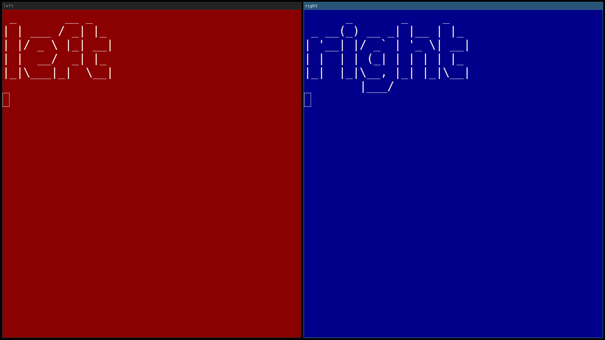](screenshots/dual-row.png) | Grid | [`dual-row`](templates/dual-row.toml) | Two windows side by side, one row | 2 |
| [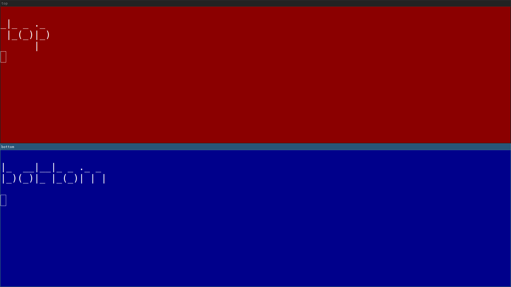](screenshots/dual-column.png) | Grid | [`dual-column`](templates/dual-column.toml) | Two windows stacked, one column | 2 |
| [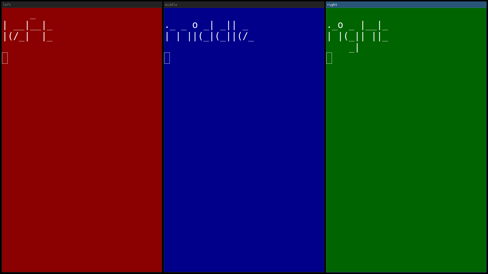](screenshots/triple-row.png) | Grid | [`triple-row`](templates/triple-row.toml) | Three windows side by side, one row | 3 |
| [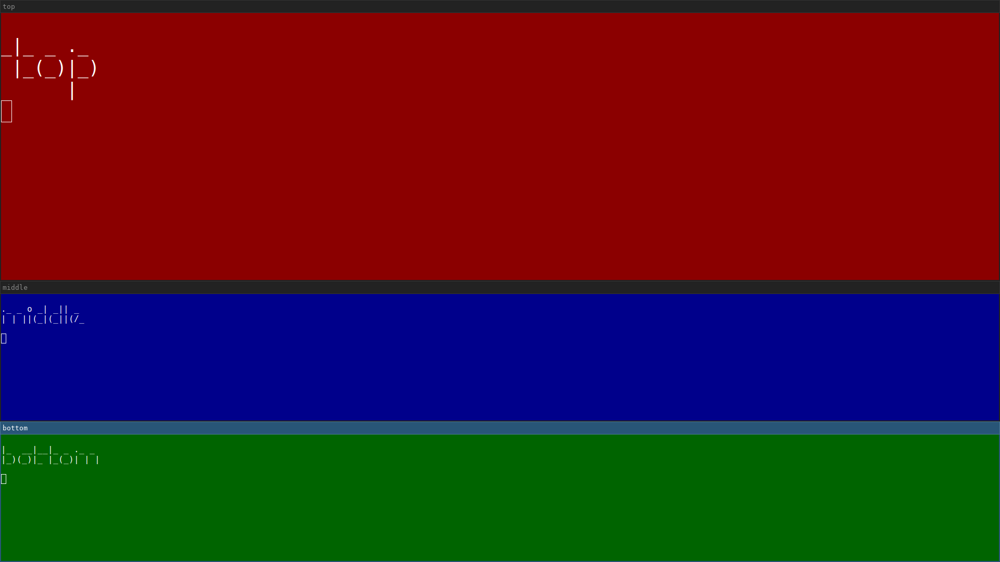](screenshots/triple-column.png) | Grid | [`triple-column`](templates/triple-column.toml) | Three windows stacked, one column | 3 |
| [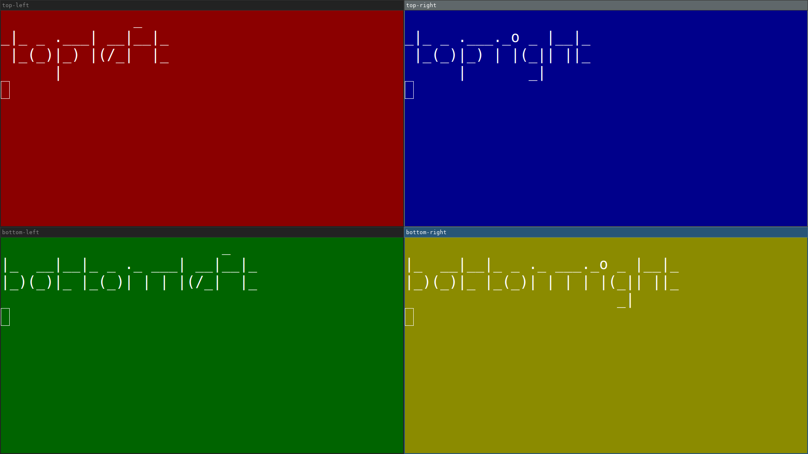](screenshots/quad-grid.png) | Grid | [`quad-grid`](templates/quad-grid.toml) | Equal 2×2 grid | 4 |
| [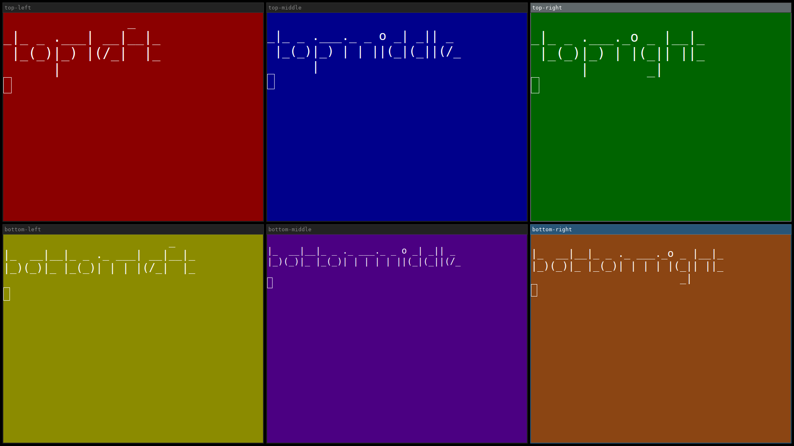](screenshots/six-grid.png) | Grid | [`six-grid`](templates/six-grid.toml) | Equal grid, two rows of three | 6 |
| [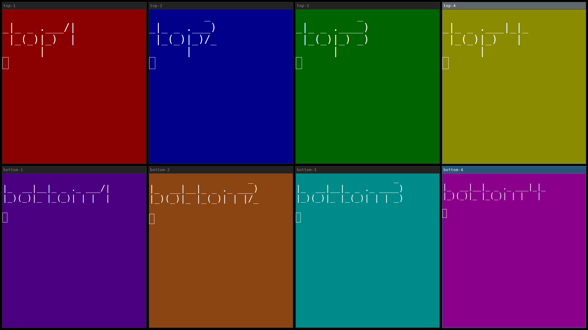](screenshots/eight-grid.png) | Grid | [`eight-grid`](templates/eight-grid.toml) | Equal grid, two rows of four | 8 |
| [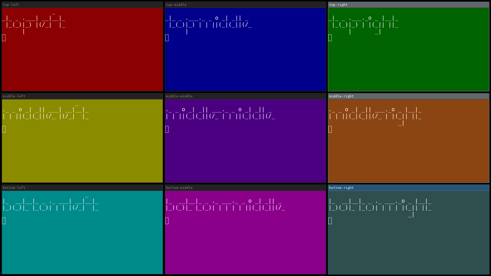](screenshots/nine-grid.png) | Grid | [`nine-grid`](templates/nine-grid.toml) | Equal 3×3 grid | 9 |
| [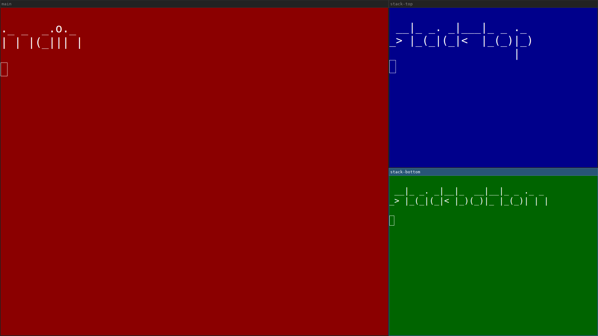](screenshots/master-dual-stack.png) | Master/stack | [`master-dual-stack`](templates/master-dual-stack.toml) | One main window, a 2-window stack beside it | 3 |
| [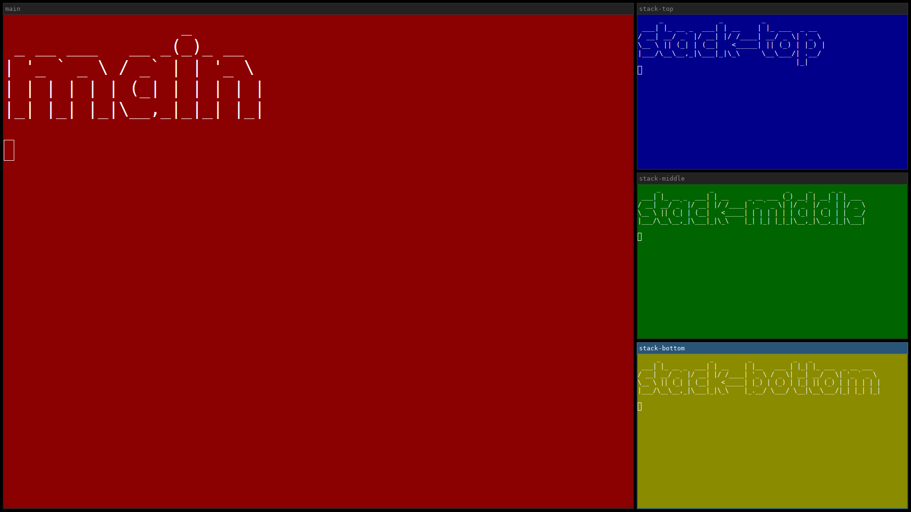](screenshots/master-triple-stack.png) | Master/stack | [`master-triple-stack`](templates/master-triple-stack.toml) | One main window, a 3-window stack beside it | 4 |
| [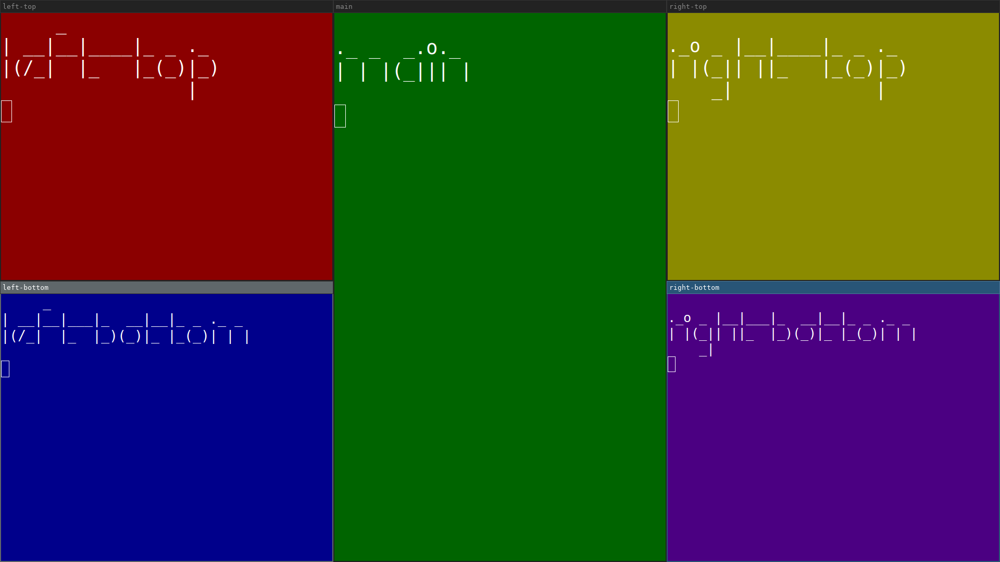](screenshots/dual-stack-sidebars.png) | Master/stack | [`dual-stack-sidebars`](templates/dual-stack-sidebars.toml) | One main window, a 2-window stack flanking each side | 5 |
| [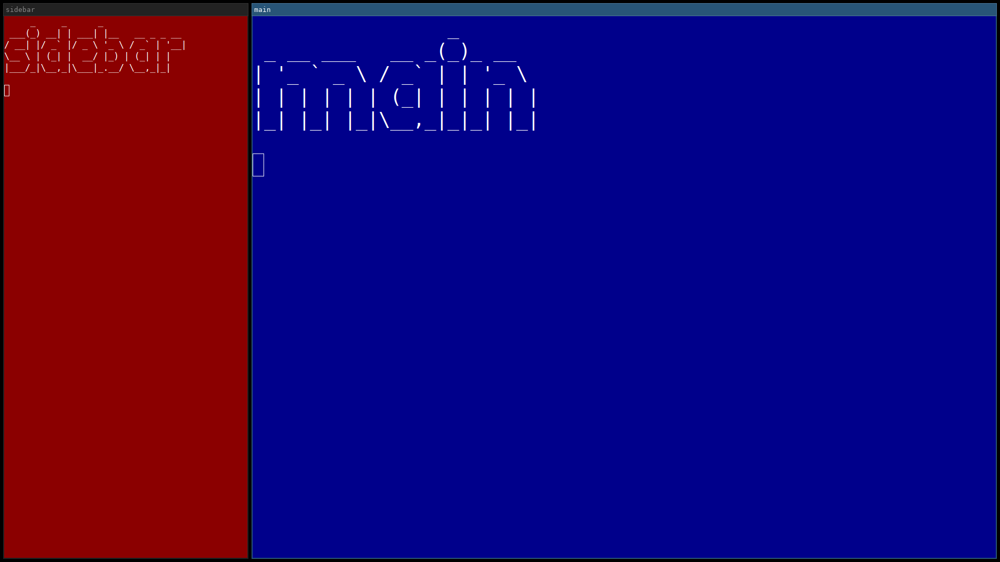](screenshots/sidebar-left.png) | Sidebar | [`sidebar-left`](templates/sidebar-left.toml) | Narrow sidebar on the left, wide main window on the right | 2 |
| [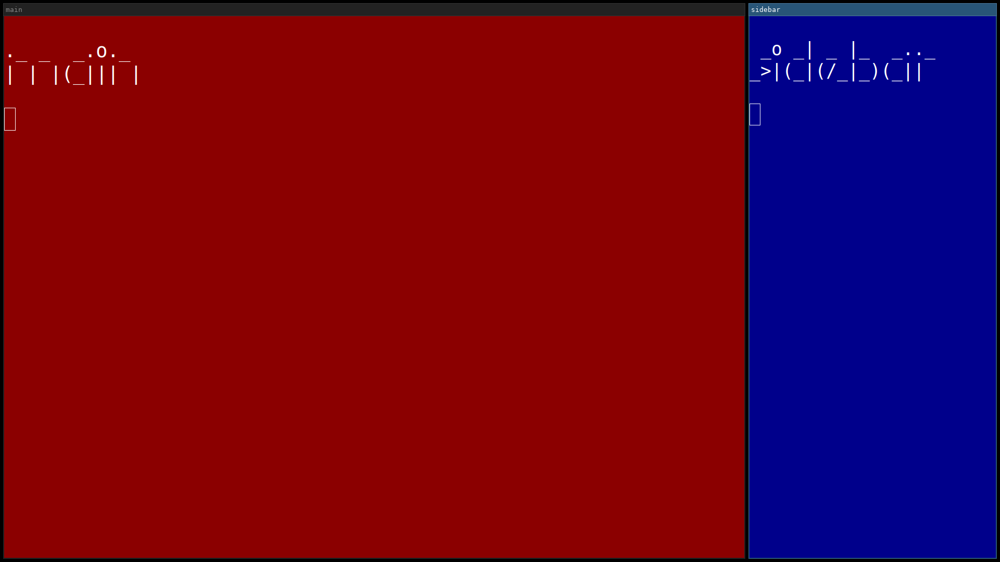](screenshots/sidebar-right.png) | Sidebar | [`sidebar-right`](templates/sidebar-right.toml) | Wide main window on the left, narrow sidebar on the right | 2 |
| [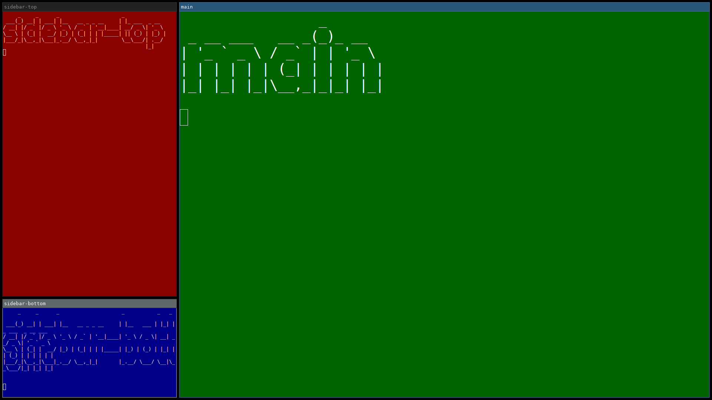](screenshots/sidebar-left-dual-stack.png) | Sidebar | [`sidebar-left-dual-stack`](templates/sidebar-left-dual-stack.toml) | Sidebar on the left split into two windows (75%/25% height), wide main window on the right | 3 |
| [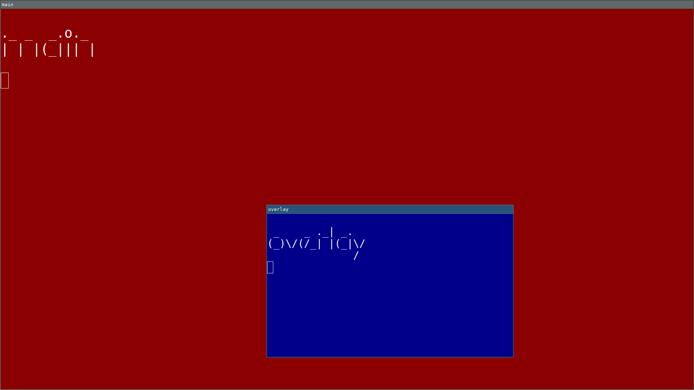](screenshots/floating-overlay.png) | Floating | [`floating-overlay`](templates/floating-overlay.toml) | A tiled main window, with a small floating window on top | 2 |
| [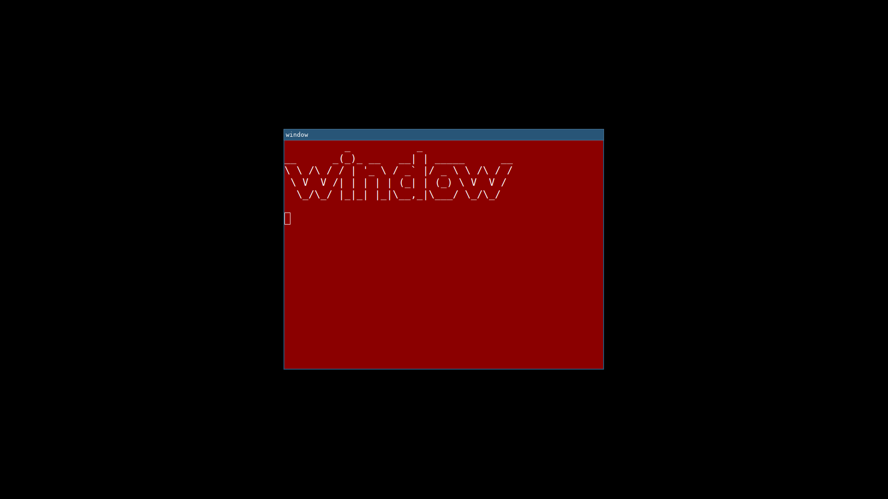](screenshots/floating-centered.png) | Floating | [`floating-centered`](templates/floating-centered.toml) | A single floating window, centered | 1 |
| — | Multi-workspace/output | [`workspace-spread`](templates/workspace-spread.toml) | Each window moved to its own named workspace | 3 |
| — | Multi-workspace/output | [`dual-output`](templates/dual-output.toml) | Each window moved to a different output (monitor) | 2 |
| [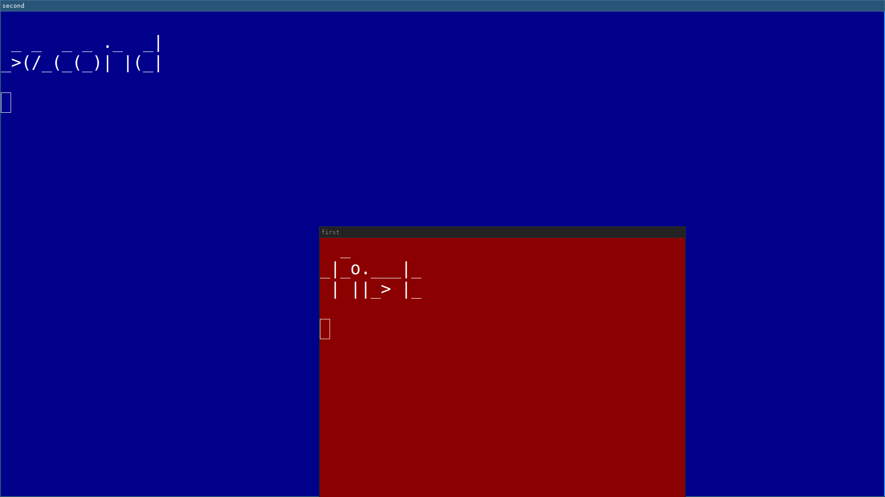](screenshots/retarget-by-slot.png) | Retargeting | [`retarget-by-slot`](templates/retarget-by-slot.toml) | Two windows side by side, then the first one retargeted by slot name | 2 |

`workspace-spread`/`dual-output` have no screenshot — `scripts/generate-layout-screenshots` skips
both, since a single-output screenshot can't meaningfully depict either (see CLAUDE.md's
"Screenshots" section).

## Actions reference

It's possible to run additional actions on the new window. Each action waits for its
corresponding Sway IPC event, or for a static `--wait-time` ms if the action doesn't have one.

Multiple actions can be added to `sway-launch` and they'll be run one after another.

These flags exist for convenience — you could just as well get the container id and run manual
`swaymsg` commands against it, set up window rules with a mark, or use other window rules
directly.

### Target an existing window

All the actions above can also run against a window that's already open, instead of always
launching a new one — useful for adjusting a window from a later step in a script without
relaunching it.

Target a specific container id (e.g. one captured from an earlier `sway-launch` call):

```shell
container_id="$(sway-launch -a foot foot)"
sway-launch --con-id "$container_id" --floating
```

Or target an already-open window by matching `--app-id`/`--class` against currently open windows,
the same way those flags match a newly launched window:

```shell
sway-launch --existing -a foot --fullscreen
```

`--existing` requires `--app-id` or `--class`, and errors if that doesn't match exactly one
window — it won't guess which one you meant. The search includes windows in Sway's scratchpad
(hidden/stashed windows), not just visible ones — if you have both a visible and a scratchpad
window with the same `app_id`/`class`, retarget with `--con-id` instead to be unambiguous.

### Floating

Makes the window floating. Useful for applications that share a single `app_id` across all their
windows — Firefox, for example, uses `app_id=firefox`.

```shell
sway-launch --floating 'firefox --new-window https://example.com'
```

### Fullscreen

Makes the window fullscreen.

```shell
sway-launch --fullscreen foot
```

### Focus

Focuses the window. Useful when a later step in a layout would otherwise leave a different window
focused — for example, focusing the first terminal after building a layout that ends by launching
a background app.

```shell
sway-launch --focus foot
```

### Mark

Add a mark to the new window. This is useful when additional rules are set up in Sway — for
example, a floating Firefox window pinned to the left side of the screen with a specific page
open.

```shell
# sway config
for_window [con_mark="firefox-floating-left"] resize set 1100 px 90 ppt, move position 20 20
```

```shell
sway-launch --mark firefox-floating-left 'firefox --new-window https://example.com'
```

### Workspace

Move the new window to a workspace.

```shell
sway-launch --workspace 2 foot
```

### Output

Move the new window to a specific output (monitor).

```shell
sway-launch --output HDMI-A-1 foot
```

### Height and width

Set the height and width of the new window. This usually works, but it depends on the current
Sway container layout — should work on both tiled and floating windows.

The format used is `100px` or `100ppt` for percent.

```shell
sway-launch --floating --width 1200px --height 80ppt foot
```

### Position

Set the position of the new window. Only makes sense for a floating window — a tiled window's
position is determined by the layout, not by coordinates, and Sway rejects the command outright
(rather than silently ignoring it) if the window isn't floating, so pair this with `--floating`.
Either `center`, or `<x>,<y>` in pixels from the top-left corner.

```shell
sway-launch --floating --position center foot
sway-launch --floating --position 100,200 foot
```

### Split

Change split on the new window.

```shell
sway-launch --split v foot
sway-launch --split h foot
```

### Verbose

Show verbose debug information. This goes to stderr, not stdout — stdout is always reserved for
the final result (the bare container id, or the `--json` object below), so
`container_id="$(sway-launch -v ...)"`-style capture still gets exactly one clean line even with
`-v` on.

```shell
$ sway-launch --split h -v foot
Sway action: Exec "foot" (app_id_match: "") (class_match: "")
Sway command: exec env SWAY_LAUNCH_PID_MARKER=<pid>-<nanos> foot
Event match: New container id 437 (PID-marker-confirmed)
Target container id: 437
Sway action: Split (container id: 437) (split: Horizontal)
No matching event types for action. Will run Sway command and wait 20 ms.
Sway command: [con_id=437] splith
Confirmed via poll (container id: 437)
437
```

### JSON output

Print the result as a JSON object instead of a bare container id, for scripts that want structured
output.

```shell
$ sway-launch --json foot
{"container_id":437}
```

### Wait time

Some actions, like split and move, do not have a corresponding Sway IPC event. For these, a
static sleep time is used instead. Depending on the machine or setup, the wait time may need to
be set higher or lower than the default.

The wait is always applied *before* the underlying Sway command, unconditionally — to let other
running IPC clients finish their own commands. *After* the command, every action in this category
now briefly polls Sway's tree instead of unconditionally sleeping the full `--wait-time` again,
returning as soon as the change is confirmed — so the actual delay is often just the one
before-command wait, not double `--wait-time`. A few cases have no way to confirm via polling
(e.g. resizing a window that's the sole occupant of its workspace is silently clamped by Sway, or
moving a tiled window that's already at the edge of its workspace), in which case the action falls
back to sleeping the full `--wait-time` again, same as before this fast path existed — so the
"roughly double `--wait-time`" figure is still the worst case, just no longer the typical one.

```shell
...
Sway action: Split (container id: 439) (split: Horizontal)
No matching event types for action. Will run Sway command and wait 100 ms.
Sway command: [con_id=439] splith
439
```

### Debug events

Prints every Sway IPC event to stdout, until stopped (`Ctrl-C`). Not part of everyday use — it's a
diagnostic tool for seeing what Sway actually sends: useful when a `sway-launch` action doesn't
behave as expected and you want to see the raw event stream Sway produces around it.

```shell
sway-launch --debug-events
```
